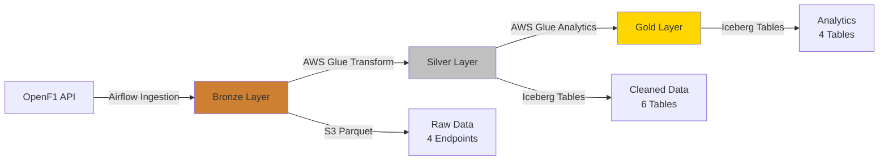

# 🏎️ F1 Data Lakehouse Pipeline

### Production-Grade Formula 1 Analytics Platform on AWS

[](https://www.python.org/)
[](https://spark.apache.org/)
[](https://iceberg.apache.org/)
[](https://airflow.apache.org/)
[](https://aws.amazon.com/)

> **Automated F1 race data pipeline processing 23 Grand Prix events through a Medallion architecture, delivering analytics-ready insights with ACID guarantees.**

---

## 📊 Architecture



### Data Flow

**🥉 Bronze Layer**: Raw data from OpenF1 API stored as Parquet files on S3
- Sessions, Drivers, Laps, Pit Stops
- Partitioned by: `year/grand_prix/session_type`

**🥈 Silver Layer**: Cleaned & normalized data in Apache Iceberg format
- 6 tables: sessions, drivers (SCD Type 2), qualifying_results, race_results, laps, pitstops
- Partitioned by: `year + grand_prix_name`
- ACID transactions with schema evolution

**🥇 Gold Layer**: Analytics-ready business insights
- 4 tables: driver performance (qualifying & race), championship tracker, race weekend insights
- Optimized for BI consumption with pre-aggregated metrics

---

## 🛠️ Tech Stack

| Component | Technology |
|-----------|------------|
| **Orchestration** | Apache Airflow 2.7.2 + AWS MWAA |
| **Processing** | Apache Spark 3.5.0 on AWS Glue 5.0 |
| **Storage** | Amazon S3 + Apache Iceberg 1.7.1 |
| **Catalog** | AWS Glue Data Catalog |
| **Data Source** | OpenF1 API |
| **Dev Environment** | Docker Compose (Spark + Airflow + PostgreSQL) |

---

## 🚀 What This Does

Processes Formula 1 race data through a **Medallion architecture** (Bronze → Silver → Gold). Automatically ingests race weekends from the **OpenF1 API**, transforms data with **Spark on AWS Glue**, and stores analytics-ready tables in **Apache Iceberg** format.

**Key Features:**
- **Dual Processing Modes**: Historical (full season) + Incremental (weekly GP auto-detection)
- **Advanced Data Modeling**: SCD Type 2 for driver team changes, partition-aware updates
- **Production-Ready**: ACID guarantees, schema evolution, time travel queries
- **F1 Business Logic**: Championship points, race insights, driver performance analytics

---

## 🏁 Quick Start

### Prerequisites
- Docker & Docker Compose
- AWS credentials configured (`~/.aws/credentials`)
- S3 bucket for data storage

### Setup

```bash
# 1. Clone and setup environment
git clone <repo-url>
cd f1-datalakehouse-pipeline
cp .env.example .env
# Edit .env with your AWS credentials and S3 bucket

# 2. Start local development environment
docker-compose up -d

# 3. Access services
# Airflow UI: http://localhost:8080 (admin/admin)
# Spark Master UI: http://localhost:8081
# Spark Worker UI: http://localhost:8082
```

### Run Your First Pipeline

1. Open Airflow UI at `http://localhost:8080`
2. Trigger DAG: **`f1_historical_load`** (processes full 2025 season)
3. Or schedule: **`f1_weekly_incremental`** (runs every Monday at 6 AM UTC)

**Pipeline Flow:**
```bash
Extract → Bronze (S3 Parquet) → Silver (Iceberg) → Gold (Analytics)
```

---

## 📁 Project Structure

```
f1-datalakehouse-pipeline/
├── docker/                      # Local development containers
│   ├── airflow/                 # Airflow Dockerfile
│   ├── spark/                   # Spark + Iceberg Dockerfile
│   └── docker-compose.yml       # Multi-service orchestration
│
├── src/
│   ├── dags/                    # Airflow DAGs
│   │   ├── f1_historical_load_dag.py       # Full year processing
│   │   ├── f1_weekly_incremental_dag.py    # Weekly GP updates
│   │   ├── config/dag_config.py            # DAG configuration
│   │   └── services/                       # OpenF1 client & S3 writer
│   │
│   └── jobs/                    # Spark transformation jobs
│       ├── f1_bronze_to_silver_transform.py
│       ├── f1_silver_to_gold_transform.py
│       ├── config/job_config.py            # Job configuration
│       ├── transforms/                     # Silver & Gold transforms
│       └── utils/                          # Reusable utilities
│           ├── data_access/                # Bronze & Silver readers
│           ├── table_management/           # Iceberg table manager
│           ├── transformations/            # SCD Type 2, common functions
│           └── analytics/                  # F1 business logic
│
├── requirements.txt             # Python dependencies
├── Makefile                     # Development commands
└── .env.example                 # Environment configuration template
```

---

## 🔧 Configuration

### Environment Variables

Key configurations in `.env`:

```bash
# AWS Configuration
AWS_REGION=us-east-1
S3_BUCKET=f1-data-lake-naveeth
S3_BRONZE_PREFIX=bronze
S3_SILVER_PREFIX=silver

# Glue Configuration
GLUE_CATALOG=glue_catalog
SILVER_DATABASE=f1_silver_db
GOLD_DATABASE=f1_gold_db

# Processing Configuration
PROCESSING_YEAR=2025
ENVIRONMENT=development
```

### DAG Configuration

- **Historical Load**: Manual trigger, processes entire year
- **Weekly Incremental**: Scheduled Monday 6 AM UTC, auto-detects latest GP

---

## 📊 Data Tables

### Bronze Layer (S3 Parquet)
- `session_result/` - Session metadata
- `drivers/` - Driver information
- `laps/` - Lap-by-lap telemetry (~20K per GP)
- `pit/` - Pit stop data

### Silver Layer (Iceberg)
| Table | Description | Special Handling |
|-------|-------------|------------------|
| `sessions_silver` | Session metadata | Sprint detection |
| `drivers_silver` | Driver master data | SCD Type 2 temporal tracking |
| `qualifying_results_silver` | Q1/Q2/Q3 times | Gap to pole calculation |
| `race_results_silver` | Race results | F1 points calculation |
| `laps_silver` | Lap telemetry | Chunked processing |
| `pitstops_silver` | Pit stop data | Tire compound analysis |

### Gold Layer (Analytics)
| Table | Description |
|-------|-------------|
| `driver_performance_summary_qualifying` | Qualifying analysis & rankings |
| `driver_performance_summary_race` | Race performance metrics |
| `championship_tracker` | Season standings with running totals |
| `race_weekend_insights` | Weekend comparisons & insights |

---

## 🎯 Processing Modes

### Historical Mode
- **Trigger**: Manual
- **Scope**: Full year (all 23 GPs)
- **Write Strategy**: Overwrite entire year partitions
- **Use Case**: Initial load, reprocessing, backfill

### Incremental Mode
- **Trigger**: Scheduled (Monday 6 AM UTC)
- **Scope**: Latest completed Grand Prix (auto-detected)
- **Write Strategy**: Partition-aware overwrite (year + GP)
- **Use Case**: Weekly race updates, real-time analytics

---

## 🔍 Data Quality

**Validation at Each Layer:**
- Bronze: File existence, record counts
- Silver: Non-null validation, partition checks, SCD Type 2 integrity
- Gold: Points calculation validation, championship aggregation correctness

**Error Handling:**
- Critical failures (sessions, drivers) halt pipeline
- Non-critical failures (pit stops, insights) are logged and continue

---

## 🚀 Performance Optimizations

- **Spark AQE**: Adaptive Query Execution enabled
- **Partition Pruning**: Filter on year + grand_prix_name at read time
- **Broadcast Joins**: Dimension tables automatically broadcast
- **Iceberg Optimizations**: Snappy compression, 128MB advisory partition size
- **Chunked Processing**: Large tables (laps) processed in GP chunks

---

## 📈 Monitoring

**Airflow UI** (`http://localhost:8080`):
- DAG run history
- Task logs and execution times
- Retry and failure tracking

**Spark UI** (`http://localhost:8081`):
- Job execution metrics
- Stage and task details
- Memory and shuffle statistics

---

## 🤝 Contributing

Contributions welcome! Please:
1. Fork the repository
2. Create a feature branch
3. Submit a pull request with clear description

---

## 📄 License

This project is licensed under the MIT License.

---

## 🔗 Resources

- [OpenF1 API Documentation](https://openf1.org/)
- [Apache Iceberg Documentation](https://iceberg.apache.org/docs/latest/)
- [AWS Glue Documentation](https://docs.aws.amazon.com/glue/)
- [Apache Airflow Documentation](https://airflow.apache.org/docs/)

---

**Built with ❤️ for F1 data enthusiasts and data engineers**
