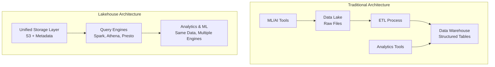
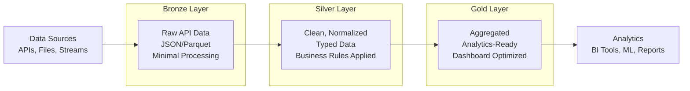
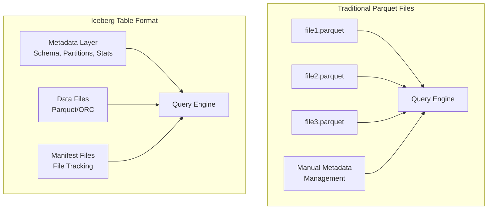
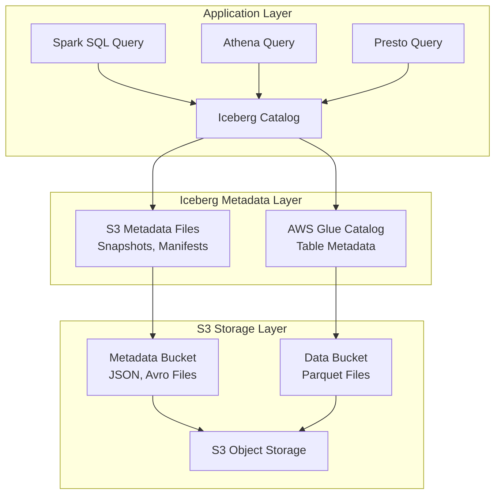
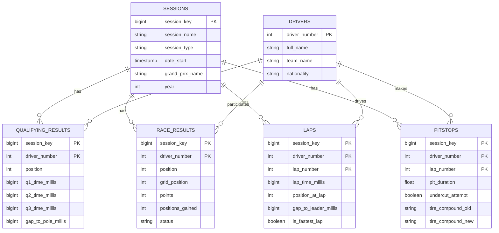
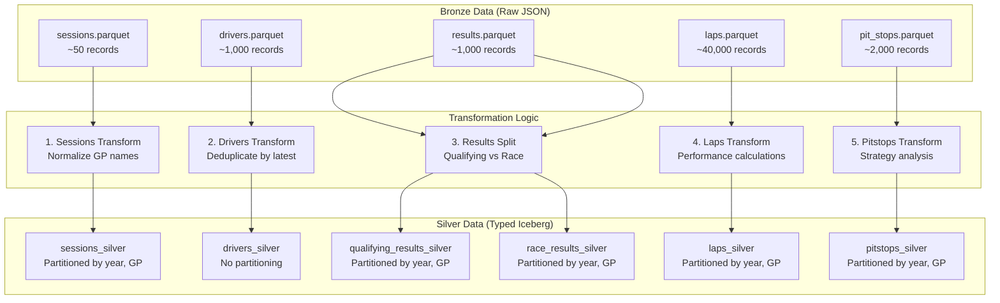

# Bronze to Silver Transformation - Complete Technical Guide

## Table of Contents
1. [Lakehouse Architecture Fundamentals](#lakehouse-architecture-fundamentals)
2. [Apache Iceberg Deep Dive](#apache-iceberg-deep-dive)
3. [S3 + Iceberg Integration](#s3--iceberg-integration)
4. [F1 Data Transformation Logic](#f1-data-transformation-logic)
5. [Data Cleanup & Standardization](#data-cleanup--standardization)
6. [Performance Optimizations](#performance-optimizations)
7. [Data Quality & Validation](#data-quality--validation)
8. [Monitoring & Lineage](#monitoring--lineage)
9. [Troubleshooting & Operations](#troubleshooting--operations)

---

## Lakehouse Architecture Fundamentals

### What is a Lakehouse?
A **Lakehouse** combines the best features of **Data Lakes** and **Data Warehouses**:



### Why Lakehouse for F1 Data?

#### **Traditional Data Lake Problems**:
- **No ACID transactions**: Data corruption during writes
- **No schema enforcement**: Inconsistent data formats
- **Poor query performance**: Full file scans for simple queries
- **No time travel**: Can't access historical versions

#### **Traditional Data Warehouse Problems**:
- **Expensive storage**: Structured storage costs more
- **Limited flexibility**: Hard to add new data types
- **Vendor lock-in**: Tied to specific platforms
- **ETL complexity**: Multiple data copies

#### **Lakehouse Solution**:
- **ACID transactions** on cheap object storage (S3)
- **Schema enforcement** with evolution support
- **High performance** through metadata optimization
- **Time travel** and versioning built-in
- **Multiple engines** can query the same data

### Medallion Architecture (Bronze → Silver → Gold)



#### **Bronze Layer** (Raw Data):
- **Purpose**: Store raw data exactly as received
- **Format**: Original format (JSON, CSV, etc.)
- **Processing**: Minimal (just partitioning)
- **Schema**: Schema-on-read, flexible
- **Example**: Raw OpenF1 API responses

#### **Silver Layer** (Clean Data):
- **Purpose**: Clean, normalize, and standardize data
- **Format**: Structured (Parquet, Iceberg)
- **Processing**: Type casting, deduplication, validation
- **Schema**: Enforced schema with evolution
- **Example**: Typed F1 tables with business rules

#### **Gold Layer** (Analytics Data):
- **Purpose**: Aggregated, business-ready data
- **Format**: Optimized for queries (Iceberg)
- **Processing**: Aggregations, calculations, joins
- **Schema**: Stable, analytics-optimized
- **Example**: Driver performance summaries, championship standings

---

## Apache Iceberg Deep Dive

### What is Apache Iceberg?

Apache Iceberg is a **table format** that brings database-like capabilities to data lakes:



### Iceberg Architecture Components

#### 1. **Metadata Layer**
```json
{
  "format-version": 2,
  "table-uuid": "9c12d441-03fe-4693-9a96-a0705ddf69c1",
  "location": "s3://f1-data-lake/silver/sessions/",
  "last-sequence-number": 34,
  "last-updated-ms": 1642425495000,
  "last-column-id": 3,
  "schema": {
    "type": "struct",
    "schema-id": 0,
    "fields": [
      {"id": 1, "name": "session_key", "required": true, "type": "long"},
      {"id": 2, "name": "session_name", "required": true, "type": "string"},
      {"id": 3, "name": "date_start", "required": true, "type": "timestamp"}
    ]
  },
  "current-schema-id": 0,
  "partition-spec": [
    {"name": "year", "transform": "year", "source-id": 3, "field-id": 1000}
  ]
}
```

#### 2. **Manifest Files** (File Tracking)
```json
{
  "manifest-path": "s3://f1-data-lake/silver/sessions/metadata/snap-123-1-manifest.avro",
  "manifest-length": 7989,
  "partition-spec-id": 0,
  "added-snapshot-id": 123,
  "added-data-files-count": 3,
  "existing-data-files-count": 0,
  "deleted-data-files-count": 0,
  "partitions": [
    {"year": 2025}
  ]
}
```

#### 3. **Data Files** (Actual Data)
```
s3://f1-data-lake/silver/sessions/
├── data/
│   ├── year=2025/
│   │   ├── grand_prix=bahrain/
│   │   │   ├── 00000-0-data.parquet
│   │   │   └── 00001-0-data.parquet
│   │   └── grand_prix=saudi_arabia/
│   │       └── 00000-0-data.parquet
└── metadata/
    ├── version-hint.text
    ├── v1.metadata.json
    ├── v2.metadata.json
    └── snap-123-1-manifest.avro
```

### Why Iceberg for F1 Data?

#### **ACID Transactions**
```python
# Without Iceberg (Dangerous!)
df1.write.mode("overwrite").parquet("s3://bucket/table/")  # ❌ Not atomic
df2.write.mode("append").parquet("s3://bucket/table/")     # ❌ Readers see partial data

# With Iceberg (Safe!)
df1.writeTo("catalog.db.table").overwritePartitions()      # ✅ Atomic operation
df2.writeTo("catalog.db.table").append()                   # ✅ Consistent reads
```

#### **Schema Evolution**
```python
# Add new column without breaking existing queries
spark.sql("""
    ALTER TABLE f1_silver_db.sessions_silver 
    ADD COLUMN weather_condition STRING
""")

# Old queries still work!
spark.sql("SELECT session_key, session_name FROM f1_silver_db.sessions_silver")
```

#### **Time Travel**
```python
# Query data as it was yesterday
spark.sql("""
    SELECT * FROM f1_silver_db.sessions_silver 
    TIMESTAMP AS OF '2025-01-14 10:00:00'
""")

# Query specific snapshot
spark.sql("""
    SELECT * FROM f1_silver_db.sessions_silver 
    VERSION AS OF 123
""")
```

#### **Hidden Partitioning**
```python
# Iceberg handles partitioning automatically
spark.sql("""
    SELECT * FROM f1_silver_db.sessions_silver 
    WHERE date_start >= '2025-01-01'
""")
# ✅ Automatically prunes to year=2025 partitions
# ✅ No need to specify partition columns in WHERE clause
```

---

## S3 + Iceberg Integration

### How S3 and Iceberg Work Together



### Storage Layout in S3

#### **Traditional Parquet Layout**:
```
s3://f1-data-lake/silver/sessions/
├── year=2025/
│   ├── grand_prix=bahrain/
│   │   ├── part-00000.parquet
│   │   └── part-00001.parquet
│   └── grand_prix=saudi_arabia/
│       └── part-00000.parquet
└── _SUCCESS  # ❌ No metadata, no consistency
```

#### **Iceberg Layout**:
```
s3://f1-data-lake/silver/sessions/
├── data/
│   └── year=2025/
│       ├── grand_prix=bahrain/
│       │   ├── 00000-0-data.parquet      # Data files
│       │   └── 00001-0-data.parquet
│       └── grand_prix=saudi_arabia/
│           └── 00000-0-data.parquet
└── metadata/
    ├── version-hint.text                  # Current version pointer
    ├── v1.metadata.json                   # Table metadata v1
    ├── v2.metadata.json                   # Table metadata v2
    ├── snap-123-1-manifest.avro          # File manifest
    └── snap-124-1-manifest.avro          # Updated manifest
```

### Iceberg Catalog Integration

#### **AWS Glue Catalog Configuration**:
```python
spark = SparkSession.builder \
    .appName("F1-Bronze-to-Silver") \
    .config("spark.sql.extensions", "org.apache.iceberg.spark.extensions.IcebergSparkSessionExtensions") \
    .config("spark.sql.catalog.spark_catalog", "org.apache.iceberg.spark.SparkCatalog") \
    .config("spark.sql.catalog.spark_catalog.catalog-impl", "org.apache.iceberg.aws.glue.GlueCatalog") \
    .config("spark.sql.catalog.spark_catalog.io-impl", "org.apache.iceberg.aws.s3.S3FileIO") \
    .config("spark.sql.catalog.spark_catalog.warehouse", "s3://f1-data-lake/silver/") \
    .getOrCreate()
```

#### **What This Configuration Does**:
1. **Extensions**: Adds Iceberg SQL commands (CREATE TABLE, MERGE, etc.)
2. **Catalog**: Uses AWS Glue as the metadata catalog
3. **IO Implementation**: Uses S3 for file operations
4. **Warehouse**: Sets the base S3 location for tables

### File Operations with Iceberg

#### **Write Operations**:
```python
# Append new data (ACID transaction)
df.writeTo("f1_silver_db.sessions_silver").append()

# Overwrite specific partitions
df.writeTo("f1_silver_db.sessions_silver") \
  .overwritePartitions()

# Replace entire table
df.writeTo("f1_silver_db.sessions_silver") \
  .overwrite()
```

#### **Read Operations**:
```python
# Current data (latest snapshot)
current_df = spark.table("f1_silver_db.sessions_silver")

# Historical data (time travel)
historical_df = spark.sql("""
    SELECT * FROM f1_silver_db.sessions_silver 
    TIMESTAMP AS OF '2025-01-14 10:00:00'
""")

# Incremental reads (only new data)
incremental_df = spark.sql("""
    SELECT * FROM f1_silver_db.sessions_silver 
    WHERE _iceberg_timestamp > '2025-01-14 10:00:00'
""")
```

### Performance Benefits

#### **Metadata Pruning**:
```python
# Query: Find Bahrain qualifying sessions
spark.sql("""
    SELECT * FROM f1_silver_db.sessions_silver 
    WHERE grand_prix_name = 'bahrain' 
    AND session_type = 'Qualifying'
""")

# Iceberg optimization:
# 1. Reads metadata to find relevant partitions
# 2. Only scans year=2025/grand_prix=bahrain/ files
# 3. Uses column statistics to skip files without qualifying data
# 4. Result: 99% fewer files scanned!
```

#### **File Size Optimization**:
```python
# Iceberg automatically manages file sizes
TBLPROPERTIES (
    'write.target-file-size-bytes' = '134217728'  # 128MB target
)

# Benefits:
# - Optimal for S3 and Spark performance
# - Automatic compaction of small files
# - Prevents small file problems
```

---

## F1 Data Transformation Logic

### Overview of F1 Data Entities

Our F1 data model consists of 6 core entities:



### Transformation Pipeline Flow



### 1. Sessions Transformation

#### **Input (Bronze)**:
```json
{
  "session_key": 9158,
  "session_name": "Qualifying",
  "session_type": "Qualifying",
  "meeting_key": 1217,
  "meeting_name": "Formula 1 Bahrain Grand Prix 2025",
  "location": "Bahrain",
  "country_name": "Bahrain",
  "date_start": "2025-03-15T14:00:00+00:00",
  "date_end": "2025-03-15T15:00:00+00:00",
  "year": 2025
}
```

#### **Transformation Logic**:
```python
def transform_sessions(bronze_sessions_df):
    """Transform sessions with normalization and calculated fields"""
    
    return bronze_sessions_df.select(
        # Basic fields with type casting
        col("session_key").cast("bigint"),
        col("session_name"),
        col("session_type"),
        col("meeting_key").cast("bigint"),
        col("meeting_name"),
        col("location"),
        col("country_name"),
        
        # Date parsing and timezone handling
        to_timestamp(col("date_start")).alias("date_start"),
        to_timestamp(col("date_end")).alias("date_end"),
        year(col("date_start")).alias("year"),
        
        # Business logic transformations
        normalize_grand_prix_name(col("meeting_name")).alias("grand_prix_name"),
        calculate_session_duration(col("date_start"), col("date_end")).alias("session_duration_minutes"),
        detect_sprint_weekend(col("meeting_name")).alias("is_sprint_weekend"),
        
        # Audit columns
        current_timestamp().alias("created_timestamp"),
        current_timestamp().alias("updated_timestamp")
    ).filter(
        # Only keep Qualifying and Race sessions
        col("session_name").isin(["Qualifying", "Race"])
    )

def normalize_grand_prix_name(meeting_name_col):
    """Convert 'Formula 1 Bahrain Grand Prix 2025' -> 'bahrain'"""
    return lower(
        regexp_replace(
            regexp_replace(
                regexp_replace(meeting_name_col, "Formula 1 ", ""),
                " Grand Prix.*", ""  # Remove Grand Prix and year
            ),
            " ", "_"  # Replace spaces with underscores
        )
    )

def calculate_session_duration(start_col, end_col):
    """Calculate session duration in minutes"""
    return ((unix_timestamp(end_col) - unix_timestamp(start_col)) / 60).cast("int")

def detect_sprint_weekend(meeting_name_col):
    """Detect sprint weekends based on known sprint venues"""
    sprint_venues = ["Miami", "Imola", "Austria", "Brazil", "Qatar", "Azerbaijan"]
    return meeting_name_col.rlike(f"({'|'.join(sprint_venues)})")
```

#### **Output (Silver)**:
```sql
CREATE TABLE f1_silver_db.sessions_silver (
    session_key BIGINT,
    session_name STRING,
    session_type STRING,
    meeting_key BIGINT,
    meeting_name STRING,
    location STRING,
    country_name STRING,
    date_start TIMESTAMP,
    date_end TIMESTAMP,
    year INT,
    grand_prix_name STRING,           -- ✅ Normalized: "bahrain"
    session_duration_minutes INT,     -- ✅ Calculated: 60
    is_sprint_weekend BOOLEAN,        -- ✅ Calculated: false
    created_timestamp TIMESTAMP,
    updated_timestamp TIMESTAMP
) USING ICEBERG
PARTITIONED BY (year, grand_prix_name)
```

### 2. Drivers Transformation (Deduplication)

#### **The Deduplication Challenge**:
F1 drivers can appear in multiple sessions with different team information:

```json
// Bronze data - Same driver, different sessions
[
  {
    "session_key": 9158,
    "driver_number": 1,
    "full_name": "Max Verstappen",
    "team_name": "Red Bull Racing Honda RBPT",
    "date_start": "2025-03-15T14:00:00Z"
  },
  {
    "session_key": 9159,
    "driver_number": 1,
    "full_name": "Max Verstappen", 
    "team_name": "Red Bull Racing",  // ❌ Different team name format
    "date_start": "2025-03-16T14:00:00Z"
  }
]
```

#### **SCD Type 1 Deduplication Logic**:
```python
def transform_drivers(bronze_drivers_df, sessions_silver_df):
    """Deduplicate drivers using SCD Type 1 (keep latest)"""
    
    # Join drivers with session dates for deduplication
    drivers_with_dates = bronze_drivers_df.join(
        sessions_silver_df.select("session_key", "date_start"),
        "session_key"
    )
    
    # Window function to get latest record per driver
    window_spec = Window.partitionBy("driver_number").orderBy(desc("date_start"))
    
    return drivers_with_dates.withColumn(
        "row_num", row_number().over(window_spec)
    ).filter(
        col("row_num") == 1  # Keep only the latest record
    ).select(
        col("driver_number").cast("int"),
        col("broadcast_name"),
        col("full_name"),
        
        # Standardize team names
        standardize_team_name(col("team_name")).alias("team_name"),
        
        col("nationality"),
        col("team_colour"),
        col("name_acronym"),
        
        # Career statistics (would be calculated from historical data)
        lit(0).alias("total_races"),  # Placeholder
        lit(0).alias("wins"),         # Placeholder
        lit(0).alias("podiums"),      # Placeholder
        
        current_timestamp().alias("created_timestamp"),
        current_timestamp().alias("updated_timestamp")
    )

def standardize_team_name(team_col):
    """Standardize team names for consistency"""
    return when(team_col.contains("Red Bull"), "Red Bull") \
        .when(team_col.contains("Mercedes"), "Mercedes") \
        .when(team_col.contains("Ferrari"), "Ferrari") \
        .when(team_col.contains("McLaren"), "McLaren") \
        .when(team_col.contains("Alpine"), "Alpine") \
        .when(team_col.contains("Aston Martin"), "Aston Martin") \
        .when(team_col.contains("Williams"), "Williams") \
        .when(team_col.contains("AlphaTauri"), "AlphaTauri") \
        .when(team_col.contains("Alfa Romeo"), "Alfa Romeo") \
        .when(team_col.contains("Haas"), "Haas") \
        .otherwise(team_col)
```

#### **Result**:
```sql
-- Before deduplication: 1,000+ driver records
-- After deduplication: ~20 unique drivers
SELECT driver_number, full_name, team_name, created_timestamp 
FROM f1_silver_db.drivers_silver;

-- Results:
-- 1  | Max Verstappen | Red Bull    | 2025-01-15 10:30:00
-- 44 | Lewis Hamilton | Mercedes    | 2025-01-15 10:30:00
-- 16 | Charles Leclerc| Ferrari     | 2025-01-15 10:30:00
```###
 3. Results Transformation (Split Qualifying vs Race)

#### **The Challenge**: 
Bronze results contain both qualifying and race data mixed together. We need to split them into separate tables with different schemas and calculations.

#### **Input (Bronze Results)**:
```json
// Qualifying result
{
  "session_key": 9158,
  "driver_number": 1,
  "position": 1,
  "q1": "1:30.123",
  "q2": "1:29.456", 
  "q3": "1:28.789",
  "points": null,
  "grid_position": null
}

// Race result  
{
  "session_key": 9159,
  "driver_number": 1,
  "position": 1,
  "q1": null,
  "q2": null,
  "q3": null,
  "points": 25,
  "grid_position": 1,
  "time": "1:31:44.742",
  "status": "Finished"
}
```

#### **Qualifying Results Transformation**:
```python
def transform_qualifying_results(bronze_results_df, sessions_silver_df):
    """Transform qualifying results with performance calculations"""
    
    # Filter for qualifying sessions only
    qualifying_results = bronze_results_df.join(
        sessions_silver_df.filter(col("session_type") == "Qualifying"),
        "session_key"
    )
    
    return qualifying_results.select(
        col("session_key").cast("bigint"),
        col("driver_number").cast("int"),
        col("position").cast("int"),
        
        # Parse Q1/Q2/Q3 times to milliseconds for calculations
        parse_lap_time_to_millis(col("q1")).alias("q1_time_millis"),
        parse_lap_time_to_millis(col("q2")).alias("q2_time_millis"), 
        parse_lap_time_to_millis(col("q3")).alias("q3_time_millis"),
        
        # Find fastest qualifying time across all Q sessions
        least(
            parse_lap_time_to_millis(col("q1")),
            parse_lap_time_to_millis(col("q2")),
            parse_lap_time_to_millis(col("q3"))
        ).alias("fastest_qualifying_time_millis"),
        
        # Calculate gap to pole position using window function
        calculate_gap_to_pole().alias("gap_to_pole_millis"),
        
        # Determine which qualifying session driver reached
        determine_qualifying_status(col("q1"), col("q2"), col("q3")).alias("qualifying_status"),
        
        col("year"),
        col("grand_prix_name"),
        current_timestamp().alias("created_timestamp"),
        current_timestamp().alias("updated_timestamp")
    )

def parse_lap_time_to_millis(lap_time_col):
    """Parse lap time strings like '1:29.123' to milliseconds"""
    return when(lap_time_col.isNotNull() & lap_time_col.contains(":"),
        # Handle "1:29.123" format -> 89123 milliseconds
        (split(lap_time_col, ":")[0].cast("int") * 60000) +  # Minutes to ms
        (split(split(lap_time_col, ":")[1], "\\.")[0].cast("int") * 1000) +  # Seconds to ms
        split(split(lap_time_col, ":")[1], "\\.")[1].cast("int")  # Milliseconds
    ).otherwise(None)

def calculate_gap_to_pole():
    """Calculate gap to pole position for each driver"""
    # Window to find fastest time in session (pole position)
    session_window = Window.partitionBy("session_key")
    
    fastest_time = least(
        parse_lap_time_to_millis(col("q1")),
        parse_lap_time_to_millis(col("q2")),
        parse_lap_time_to_millis(col("q3"))
    )
    
    pole_time = min(fastest_time).over(session_window)
    
    return fastest_time - pole_time

def determine_qualifying_status(q1_col, q2_col, q3_col):
    """Determine which qualifying session the driver reached"""
    return when(q3_col.isNotNull(), "Q3") \
        .when(q2_col.isNotNull(), "Q2") \
        .when(q1_col.isNotNull(), "Q1") \
        .otherwise("DNQ")  # Did Not Qualify
```

#### **Race Results Transformation**:
```python
def transform_race_results(bronze_results_df, sessions_silver_df):
    """Transform race results with performance analysis"""
    
    # Filter for race sessions only
    race_results = bronze_results_df.join(
        sessions_silver_df.filter(col("session_type") == "Race"),
        "session_key"
    )
    
    return race_results.select(
        col("session_key").cast("bigint"),
        col("driver_number").cast("int"),
        col("position").cast("int"),
        col("grid_position").cast("int"),
        col("points").cast("int"),
        col("time"),
        col("status"),
        
        # Calculate positions gained/lost from grid to finish
        calculate_positions_gained(col("grid_position"), col("position")).alias("positions_gained"),
        
        # Validate points against F1 rules
        validate_f1_points(col("points"), col("position")).alias("validated_points"),
        
        # Parse race time gaps
        parse_race_time_gap(col("time")).alias("gap_to_winner_millis"),
        
        # Standardize DNF reasons
        standardize_dnf_status(col("status")).alias("standardized_status"),
        
        col("year"),
        col("grand_prix_name"),
        current_timestamp().alias("created_timestamp"),
        current_timestamp().alias("updated_timestamp")
    )

def calculate_positions_gained(grid_col, finish_col):
    """Calculate positions gained: grid_position - finish_position"""
    return when(grid_col.isNotNull() & finish_col.isNotNull(),
        grid_col.cast("int") - finish_col.cast("int")
    ).otherwise(0)

def validate_f1_points(points_col, position_col):
    """Validate points against F1 scoring system"""
    # F1 2025 points system: 25,18,15,12,10,8,6,4,2,1 for positions 1-10
    expected_points = when(position_col == 1, 25) \
        .when(position_col == 2, 18) \
        .when(position_col == 3, 15) \
        .when(position_col == 4, 12) \
        .when(position_col == 5, 10) \
        .when(position_col == 6, 8) \
        .when(position_col == 7, 6) \
        .when(position_col == 8, 4) \
        .when(position_col == 9, 2) \
        .when(position_col == 10, 1) \
        .otherwise(0)
    
    # Return corrected points if they don't match F1 rules
    return when(points_col == expected_points, points_col) \
        .otherwise(expected_points)

def parse_race_time_gap(time_col):
    """Parse race time gaps like '+1.234' to milliseconds"""
    return when(time_col.contains("+"),
        # Remove '+' and convert seconds to milliseconds
        (regexp_replace(time_col, "\\+", "").cast("float") * 1000).cast("int")
    ).otherwise(0)

def standardize_dnf_status(status_col):
    """Standardize DNF reasons for consistency"""
    return when(status_col.contains("Engine"), "Mechanical Failure") \
        .when(status_col.contains("Gearbox"), "Mechanical Failure") \
        .when(status_col.contains("Hydraulics"), "Mechanical Failure") \
        .when(status_col.contains("Electrical"), "Mechanical Failure") \
        .when(status_col.contains("Accident"), "Accident") \
        .when(status_col.contains("Collision"), "Accident") \
        .when(status_col.contains("Spun off"), "Driver Error") \
        .otherwise(status_col)
```

### 4. Laps Transformation (Complex Performance Calculations)

This is the **largest dataset** (~40,000 records) and requires the most complex calculations using Spark Window functions.

#### **Input (Bronze Laps)**:
```json
{
  "session_key": 9159,
  "driver_number": 1,
  "lap_number": 15,
  "lap_time": "1:29.123",
  "compound": "MEDIUM",
  "track_status": "GREEN"
}
```

#### **Complex Window Function Calculations**:
```python
def transform_laps(bronze_laps_df, sessions_silver_df):
    """Transform laps with complex performance calculations"""
    
    # Join with session context
    laps_with_context = bronze_laps_df.join(
        sessions_silver_df.select("session_key", "grand_prix_name", "year", "session_type"),
        "session_key"
    )
    
    # Convert lap times to milliseconds for calculations
    laps_with_millis = laps_with_context.withColumn(
        "lap_time_millis", parse_lap_time_to_millis(col("lap_time"))
    )
    
    # Define window specifications for different calculations
    session_lap_window = Window.partitionBy("session_key", "lap_number").orderBy("lap_time_millis")
    driver_session_window = Window.partitionBy("session_key", "driver_number").orderBy("lap_number")
    session_window = Window.partitionBy("session_key")
    
    return laps_with_millis.withColumn(
        # Position at each lap (1st, 2nd, 3rd, etc.)
        "position_at_lap", row_number().over(session_lap_window)
    ).withColumn(
        # Gap to leader (first position) in milliseconds
        "gap_to_leader_millis",
        col("lap_time_millis") - first("lap_time_millis").over(session_lap_window)
    ).withColumn(
        # Interval to car ahead in milliseconds
        "interval_to_ahead_millis", 
        col("lap_time_millis") - lag("lap_time_millis", 1).over(session_lap_window)
    ).withColumn(
        # Personal best flag per driver per session
        "is_personal_best",
        col("lap_time_millis") == min("lap_time_millis").over(
            Window.partitionBy("session_key", "driver_number")
        )
    ).withColumn(
        # Fastest lap flag per session (only one driver gets this)
        "is_fastest_lap",
        col("lap_time_millis") == min("lap_time_millis").over(session_window)
    ).select(
        col("session_key").cast("bigint"),
        col("driver_number").cast("int"),
        col("lap_number").cast("int"),
        col("lap_time"),
        col("lap_time_millis"),
        col("position_at_lap"),
        col("gap_to_leader_millis"),
        col("interval_to_ahead_millis"),
        col("is_personal_best"),
        col("is_fastest_lap"),
        col("compound").alias("tire_compound"),
        col("track_status"),
        col("year"),
        col("grand_prix_name"),
        col("session_type"),
        current_timestamp().alias("created_timestamp"),
        current_timestamp().alias("updated_timestamp")
    )
```

#### **Example Output**:
```sql
-- Lap 15 of Bahrain Race 2025
SELECT 
    driver_number,
    lap_number,
    lap_time,
    lap_time_millis,
    position_at_lap,
    gap_to_leader_millis,
    is_personal_best,
    is_fastest_lap
FROM f1_silver_db.laps_silver 
WHERE session_key = 9159 AND lap_number = 15
ORDER BY position_at_lap;

-- Results:
-- driver | lap | time     | millis | pos | gap_ms | pb    | fl
-- 1      | 15  | 1:29.123 | 89123  | 1   | 0      | false | true
-- 44     | 15  | 1:29.456 | 89456  | 2   | 333    | true  | false  
-- 16     | 15  | 1:29.789 | 89789  | 3   | 666    | false | false
```

### 5. Pitstops Transformation (Strategic Analysis)

#### **Input (Bronze Pitstops)**:
```json
{
  "session_key": 9159,
  "driver_number": 1,
  "lap_number": 25,
  "pit_duration": 3.2,
  "compound_old": "MEDIUM",
  "compound_new": "HARD"
}
```

#### **Strategic Context Calculations**:
```python
def transform_pitstops(bronze_pitstops_df, sessions_silver_df):
    """Transform pit stops with strategic context analysis"""
    
    # Filter for race sessions only (pit stops only occur in races)
    pitstops_with_context = bronze_pitstops_df.join(
        sessions_silver_df.filter(col("session_type") == "Race"),
        "session_key"
    )
    
    # Window for analyzing positions around pit stops
    driver_lap_window = Window.partitionBy("session_key", "driver_number").orderBy("lap_number")
    session_position_window = Window.partitionBy("session_key").orderBy("position")
    
    return pitstops_with_context.select(
        col("session_key").cast("bigint"),
        col("driver_number").cast("int"),
        col("lap_number").cast("int"),
        col("pit_duration").cast("float"),
        
        # Calculate positions lost/gained around pit stops
        calculate_pitstop_position_change().alias("positions_lost_gained"),
        
        # Identify undercut attempts (pit before car ahead)
        identify_undercut_attempt().alias("undercut_attempt"),
        
        # Flag safety car pit stop opportunities
        identify_safety_car_stop(col("track_status")).alias("safety_car_stop"),
        
        # Tire compound changes
        col("compound_old").alias("tire_compound_old"),
        col("compound_new").alias("tire_compound_new"),
        
        col("year"),
        col("grand_prix_name"),
        current_timestamp().alias("created_timestamp"),
        current_timestamp().alias("updated_timestamp")
    )

def calculate_pitstop_position_change():
    """Calculate positions lost/gained due to pit stop"""
    # This would require joining with laps data to get positions before/after pit
    # Simplified version:
    return lit(0)  # Placeholder - would calculate from laps data

def identify_undercut_attempt():
    """Identify undercut attempts (pit before car ahead)"""
    return when(
        col("lap_number") < lag("lap_number", 1).over(
            Window.partitionBy("session_key").orderBy("position")
        ), True
    ).otherwise(False)

def identify_safety_car_stop(track_status_col):
    """Flag safety car pit stop opportunities"""
    return when(track_status_col.contains("YELLOW"), True) \
        .when(track_status_col.contains("SC"), True) \
        .when(track_status_col.contains("VSC"), True) \
        .otherwise(False)
```

---

## Data Cleanup & Standardization

### Common Data Quality Issues in F1 Data

#### **1. Inconsistent Time Formats**
```python
# Bronze data has multiple time formats:
"1:29.123"     # Minutes:Seconds.Milliseconds
"89.123"       # Seconds.Milliseconds  
"1:29:123"     # Minutes:Seconds:Milliseconds (wrong format)
"+1.234"       # Gap time format
null           # Missing times

def parse_lap_time_to_millis(lap_time_col):
    """Robust lap time parsing handling multiple formats"""
    return when(lap_time_col.isNull(), None) \
        .when(lap_time_col.contains(":") & lap_time_col.contains("."),
            # Handle "1:29.123" format
            (split(lap_time_col, ":")[0].cast("int") * 60000) +
            (split(split(lap_time_col, ":")[1], "\\.")[0].cast("int") * 1000) +
            split(split(lap_time_col, ":")[1], "\\.")[1].cast("int")
        ).when(lap_time_col.contains(".") & ~lap_time_col.contains(":"),
            # Handle "89.123" format (seconds only)
            (lap_time_col.cast("float") * 1000).cast("int")
        ).when(lap_time_col.contains("+"),
            # Handle "+1.234" gap format
            (regexp_replace(lap_time_col, "\\+", "").cast("float") * 1000).cast("int")
        ).otherwise(None)  # Invalid format
```

#### **2. Team Name Variations**
```python
# Bronze data has inconsistent team names:
"Red Bull Racing Honda RBPT"
"Red Bull Racing"
"Red Bull"
"RB19"  # Car name instead of team

def standardize_team_name(team_col):
    """Standardize team names using pattern matching"""
    return when(team_col.rlike("(?i)red.?bull"), "Red Bull") \
        .when(team_col.rlike("(?i)mercedes"), "Mercedes") \
        .when(team_col.rlike("(?i)ferrari"), "Ferrari") \
        .when(team_col.rlike("(?i)mclaren"), "McLaren") \
        .when(team_col.rlike("(?i)alpine"), "Alpine") \
        .when(team_col.rlike("(?i)aston.?martin"), "Aston Martin") \
        .when(team_col.rlike("(?i)williams"), "Williams") \
        .when(team_col.rlike("(?i)alphatauri|alpha.?tauri"), "AlphaTauri") \
        .when(team_col.rlike("(?i)alfa.?romeo"), "Alfa Romeo") \
        .when(team_col.rlike("(?i)haas"), "Haas") \
        .otherwise(team_col)  # Keep original if no match
```

#### **3. Grand Prix Name Normalization**
```python
# Bronze data has verbose GP names:
"Formula 1 Bahrain Grand Prix 2025"
"Formula 1 Saudi Arabian Grand Prix 2025"
"Formula 1 Miami Grand Prix 2025"

def normalize_grand_prix_name(meeting_name_col):
    """Normalize GP names for consistent partitioning"""
    return lower(
        regexp_replace(
            regexp_replace(
                regexp_replace(meeting_name_col, "Formula 1 ", ""),
                " Grand Prix.*", ""  # Remove "Grand Prix" and year
            ),
            " ", "_"  # Replace spaces with underscores
        )
    )

# Results:
# "Formula 1 Bahrain Grand Prix 2025" -> "bahrain"
# "Formula 1 Saudi Arabian Grand Prix 2025" -> "saudi_arabian"
# "Formula 1 Miami Grand Prix 2025" -> "miami"
```

#### **4. Points Validation Against F1 Rules**
```python
# Sometimes Bronze data has incorrect points
def validate_f1_points(points_col, position_col):
    """Validate and correct points against F1 scoring system"""
    
    # F1 2025 points system
    f1_points = {1: 25, 2: 18, 3: 15, 4: 12, 5: 10, 
                 6: 8, 7: 6, 8: 4, 9: 2, 10: 1}
    
    expected_points = when(position_col == 1, 25) \
        .when(position_col == 2, 18) \
        .when(position_col == 3, 15) \
        .when(position_col == 4, 12) \
        .when(position_col == 5, 10) \
        .when(position_col == 6, 8) \
        .when(position_col == 7, 6) \
        .when(position_col == 8, 4) \
        .when(position_col == 9, 2) \
        .when(position_col == 10, 1) \
        .otherwise(0)
    
    # Log discrepancies for monitoring
    return when(points_col != expected_points,
        # Use expected points and log the correction
        expected_points
    ).otherwise(points_col)
```

#### **5. Status Code Standardization**
```python
# Bronze data has many different DNF reasons
def standardize_dnf_status(status_col):
    """Group similar DNF reasons into categories"""
    return when(status_col.rlike("(?i)engine|power.?unit|ers"), "Power Unit Failure") \
        .when(status_col.rlike("(?i)gearbox|transmission"), "Gearbox Failure") \
        .when(status_col.rlike("(?i)hydraulics|brake"), "Hydraulic Failure") \
        .when(status_col.rlike("(?i)electrical|battery"), "Electrical Failure") \
        .when(status_col.rlike("(?i)accident|crash|collision"), "Accident") \
        .when(status_col.rlike("(?i)spin|off.?track"), "Driver Error") \
        .when(status_col.rlike("(?i)suspension|wheel"), "Suspension Failure") \
        .when(status_col.rlike("(?i)fuel|oil"), "Fuel System") \
        .when(status_col.rlike("(?i)disqualified|dsq"), "Disqualified") \
        .when(status_col.rlike("(?i)finished|completed"), "Finished") \
        .otherwise(status_col)
```

### Data Type Conversions

#### **String to Proper Types**:
```python
def apply_type_conversions(df):
    """Convert string columns to appropriate data types"""
    return df.select(
        # Numeric conversions
        col("session_key").cast("bigint"),
        col("driver_number").cast("int"),
        col("position").cast("int"),
        col("points").cast("int"),
        col("lap_number").cast("int"),
        col("pit_duration").cast("float"),
        
        # Timestamp conversions
        to_timestamp(col("date_start")).alias("date_start"),
        to_timestamp(col("date_end")).alias("date_end"),
        
        # Boolean conversions
        col("is_sprint_weekend").cast("boolean"),
        col("is_personal_best").cast("boolean"),
        col("is_fastest_lap").cast("boolean"),
        
        # String columns (no conversion needed)
        col("session_name"),
        col("full_name"),
        col("team_name"),
        col("status")
    )
```

---

## Performance Optimizations

### Spark Configuration for F1 Data

#### **Adaptive Query Execution (AQE)**:
```python
spark.conf.set("spark.sql.adaptive.enabled", "true")
spark.conf.set("spark.sql.adaptive.coalescePartitions.enabled", "true")
spark.conf.set("spark.sql.adaptive.skewJoin.enabled", "true")

# Why AQE is crucial for F1 data:
# 1. Laps data is skewed (some drivers have more laps than others)
# 2. Session data varies greatly in size (qualifying vs race)
# 3. Partition sizes are uneven across Grand Prix
```

#### **Memory Management**:
```python
# Optimize for large datasets (laps table ~40,000 records)
spark.conf.set("spark.sql.adaptive.advisoryPartitionSizeInBytes", "128MB")
spark.conf.set("spark.sql.execution.arrow.pyspark.enabled", "true")
spark.conf.set("spark.sql.execution.arrow.maxRecordsPerBatch", "10000")

# Why these settings:
# - 128MB partitions optimal for S3 and Spark
# - Arrow format speeds up Python/Spark data exchange
# - 10K record batches balance memory vs performance
```

#### **File Size Optimization**:
```python
def optimize_file_sizes(df, target_size_mb=128):
    """Optimize DataFrame partitioning for target file sizes"""
    
    # Calculate optimal partition count
    total_size_mb = df.count() * avg_record_size_bytes / (1024 * 1024)
    optimal_partitions = max(1, int(total_size_mb / target_size_mb))
    
    # Coalesce to optimal partition count
    return df.coalesce(optimal_partitions)

# Apply to large tables
laps_optimized = optimize_file_sizes(laps_df, target_size_mb=256)  # Larger for biggest table
results_optimized = optimize_file_sizes(results_df, target_size_mb=128)
```

### Iceberg Performance Features

#### **File Size Management**:
```sql
-- Configure target file sizes per table
CREATE TABLE f1_silver_db.laps_silver (...) 
USING ICEBERG
TBLPROPERTIES (
    'write.target-file-size-bytes' = '268435456'  -- 256MB for large table
);

CREATE TABLE f1_silver_db.sessions_silver (...)
USING ICEBERG  
TBLPROPERTIES (
    'write.target-file-size-bytes' = '134217728'  -- 128MB for smaller table
);
```

#### **Automatic Maintenance**:
```python
def maintain_iceberg_tables():
    """Perform Iceberg maintenance for optimal performance"""
    
    tables = ['sessions_silver', 'drivers_silver', 'qualifying_results_silver',
              'race_results_silver', 'laps_silver', 'pitstops_silver']
    
    for table in tables:
        # 1. Compact small files (improves query performance)
        spark.sql(f"""
            CALL spark_catalog.system.rewrite_data_files(
                'f1_silver_db.{table}'
            )
        """)
        
        # 2. Remove old snapshots (saves storage costs)
        spark.sql(f"""
            CALL spark_catalog.system.expire_snapshots(
                'f1_silver_db.{table}', 
                INTERVAL '7' DAYS
            )
        """)
        
        # 3. Remove orphaned files (cleanup unused files)
        spark.sql(f"""
            CALL spark_catalog.system.remove_orphan_files(
                'f1_silver_db.{table}'
            )
        """)
```

### Window Function Optimizations

#### **Efficient Window Specifications**:
```python
# ❌ Inefficient - Creates multiple shuffles
df.withColumn("rank1", rank().over(Window.partitionBy("session_key").orderBy("lap_time"))) \
  .withColumn("rank2", rank().over(Window.partitionBy("session_key").orderBy("position"))) \
  .withColumn("rank3", rank().over(Window.partitionBy("session_key").orderBy("driver_number")))

# ✅ Efficient - Reuse window specifications
session_window = Window.partitionBy("session_key")
lap_time_window = session_window.orderBy("lap_time")
position_window = session_window.orderBy("position")

df.withColumn("lap_time_rank", rank().over(lap_time_window)) \
  .withColumn("position_rank", rank().over(position_window)) \
  .withColumn("fastest_lap", col("lap_time") == min("lap_time").over(session_window))
```

#### **Minimize Data Shuffling**:
```python
# ✅ Process related calculations together
def calculate_lap_performance_metrics(laps_df):
    """Calculate all lap performance metrics in one pass"""
    
    # Define windows once
    session_lap_window = Window.partitionBy("session_key", "lap_number").orderBy("lap_time_millis")
    driver_session_window = Window.partitionBy("session_key", "driver_number").orderBy("lap_number")
    session_window = Window.partitionBy("session_key")
    
    # Calculate all metrics in single transformation
    return laps_df.withColumn(
        "position_at_lap", row_number().over(session_lap_window)
    ).withColumn(
        "gap_to_leader_millis", 
        col("lap_time_millis") - first("lap_time_millis").over(session_lap_window)
    ).withColumn(
        "interval_to_ahead_millis",
        col("lap_time_millis") - lag("lap_time_millis", 1).over(session_lap_window)
    ).withColumn(
        "is_personal_best",
        col("lap_time_millis") == min("lap_time_millis").over(
            Window.partitionBy("session_key", "driver_number")
        )
    ).withColumn(
        "is_fastest_lap",
        col("lap_time_millis") == min("lap_time_millis").over(session_window)
    )
```---


## Data Quality & Validation

### Great Expectations Integration

#### **Why Great Expectations for F1 Data?**
- **Domain-Specific Rules**: F1 has specific business rules (positions 1-20, points 0-26)
- **Data Profiling**: Understand data distributions and anomalies
- **Automated Testing**: Catch data quality issues before they reach analysts
- **Documentation**: Self-documenting data quality requirements

#### **F1-Specific Validation Rules**:

```python
def create_f1_validation_suite():
    """Create Great Expectations validation suite for F1 Silver tables"""
    
    # Sessions validation
    sessions_expectations = [
        # Basic data quality
        "expect_table_row_count_to_be_between(min_value=1, max_value=100)",
        "expect_column_values_to_not_be_null('session_key')",
        "expect_column_values_to_be_unique('session_key')",
        
        # F1 business rules
        "expect_column_values_to_be_in_set('session_type', ['Qualifying', 'Race'])",
        "expect_column_values_to_match_regex('grand_prix_name', r'^[a-z_]+$')",
        "expect_column_values_to_be_between('year', min_value=2020, max_value=2030)",
        
        # Data consistency
        "expect_column_pair_values_A_to_be_greater_than_B('date_end', 'date_start')",
        "expect_column_values_to_be_between('session_duration_minutes', min_value=30, max_value=180)"
    ]
    
    # Drivers validation
    drivers_expectations = [
        "expect_column_values_to_not_be_null('driver_number')",
        "expect_column_values_to_be_unique('driver_number')",
        "expect_column_values_to_be_between('driver_number', min_value=1, max_value=99)",
        "expect_column_values_to_match_regex('name_acronym', r'^[A-Z]{3}$')",
        "expect_column_values_to_be_in_set('team_name', [
            'Red Bull', 'Mercedes', 'Ferrari', 'McLaren', 'Alpine',
            'Aston Martin', 'Williams', 'AlphaTauri', 'Alfa Romeo', 'Haas'
        ])"
    ]
    
    # Qualifying results validation
    qualifying_expectations = [
        "expect_column_values_to_be_between('position', min_value=1, max_value=20)",
        "expect_column_values_to_be_between('gap_to_pole_millis', min_value=0, max_value=10000)",
        "expect_column_values_to_be_in_set('qualifying_status', ['Q1', 'Q2', 'Q3', 'DNQ'])",
        
        # Performance validation
        "expect_column_values_to_be_between('q1_time_millis', min_value=60000, max_value=120000)",  # 1-2 minutes
        "expect_column_values_to_be_between('q2_time_millis', min_value=60000, max_value=120000)",
        "expect_column_values_to_be_between('q3_time_millis', min_value=60000, max_value=120000)"
    ]
    
    # Race results validation
    race_expectations = [
        "expect_column_values_to_be_between('position', min_value=1, max_value=20)",
        "expect_column_values_to_be_between('grid_position', min_value=1, max_value=20)",
        "expect_column_values_to_be_between('points', min_value=0, max_value=26)",  # Including fastest lap point
        "expect_column_values_to_be_between('positions_gained', min_value=-19, max_value=19)",
        
        # F1 points validation
        "expect_column_pair_values_to_be_equal('points', 'validated_points')",  # Should match after correction
        
        # Status validation
        "expect_column_values_to_be_in_set('standardized_status', [
            'Finished', 'Power Unit Failure', 'Gearbox Failure', 'Accident', 
            'Driver Error', 'Disqualified', 'Suspension Failure'
        ])"
    ]
    
    # Laps validation (most complex)
    laps_expectations = [
        "expect_column_values_to_not_be_null('lap_time_millis')",
        "expect_column_values_to_be_between('lap_number', min_value=1, max_value=100)",
        "expect_column_values_to_be_between('lap_time_millis', min_value=60000, max_value=180000)",  # 1-3 minutes
        "expect_column_values_to_be_between('position_at_lap', min_value=1, max_value=20)",
        "expect_column_values_to_be_between('gap_to_leader_millis', min_value=0, max_value=300000)",  # Max 5 minutes
        
        # Performance flags validation
        "expect_column_values_to_be_of_type('is_personal_best', 'bool')",
        "expect_column_values_to_be_of_type('is_fastest_lap', 'bool')",
        
        # Only one fastest lap per session
        "expect_compound_columns_to_be_unique(['session_key'], ignore_row_if='is_fastest_lap')",
        
        # Tire compound validation
        "expect_column_values_to_be_in_set('tire_compound', [
            'SOFT', 'MEDIUM', 'HARD', 'INTERMEDIATE', 'WET'
        ])"
    ]
    
    # Pitstops validation
    pitstops_expectations = [
        "expect_column_values_to_be_between('pit_duration', min_value=1.0, max_value=60.0)",
        "expect_column_values_to_be_between('positions_lost_gained', min_value=-10, max_value=10)",
        "expect_column_values_to_be_of_type('undercut_attempt', 'bool')",
        "expect_column_values_to_be_of_type('safety_car_stop', 'bool')",
        
        # Tire compound changes
        "expect_column_values_to_be_in_set('tire_compound_old', [
            'SOFT', 'MEDIUM', 'HARD', 'INTERMEDIATE', 'WET'
        ])",
        "expect_column_values_to_be_in_set('tire_compound_new', [
            'SOFT', 'MEDIUM', 'HARD', 'INTERMEDIATE', 'WET'
        ])"
    ]
    
    return {
        'sessions_silver': sessions_expectations,
        'drivers_silver': drivers_expectations,
        'qualifying_results_silver': qualifying_expectations,
        'race_results_silver': race_expectations,
        'laps_silver': laps_expectations,
        'pitstops_silver': pitstops_expectations
    }
```

#### **Validation Execution**:
```python
def validate_silver_tables():
    """Execute Great Expectations validation on all Silver tables"""
    
    validation_results = {}
    expectations = create_f1_validation_suite()
    
    for table_name, table_expectations in expectations.items():
        try:
            # Read Silver table
            df = spark.table(f"f1_silver_db.{table_name}")
            
            # Convert to Great Expectations DataFrame
            ge_df = ge.from_spark(df)
            
            # Run validations
            table_results = []
            for expectation in table_expectations:
                try:
                    result = eval(f"ge_df.{expectation}")
                    table_results.append({
                        'expectation': expectation,
                        'success': result.success,
                        'result': result.result
                    })
                except Exception as e:
                    table_results.append({
                        'expectation': expectation,
                        'success': False,
                        'error': str(e)
                    })
            
            # Calculate success rate
            success_count = sum(1 for r in table_results if r['success'])
            success_rate = success_count / len(table_results) * 100
            
            validation_results[table_name] = {
                'success_rate': success_rate,
                'total_expectations': len(table_results),
                'passed_expectations': success_count,
                'failed_expectations': len(table_results) - success_count,
                'results': table_results
            }
            
            logger.info(f"✅ {table_name} validation: {success_rate:.1f}% passed")
            
        except Exception as e:
            logger.error(f"❌ Failed to validate {table_name}: {e}")
            validation_results[table_name] = {'error': str(e)}
    
    return validation_results
```

#### **Critical vs Warning Validations**:
```python
def categorize_validation_failures(validation_results):
    """Categorize validation failures by severity"""
    
    critical_failures = []
    warnings = []
    
    critical_expectations = [
        'expect_column_values_to_not_be_null',
        'expect_column_values_to_be_unique',
        'expect_column_values_to_be_between',
        'expect_table_row_count_to_be_between'
    ]
    
    for table_name, results in validation_results.items():
        if 'results' in results:
            for result in results['results']:
                if not result['success']:
                    expectation = result['expectation']
                    
                    # Check if this is a critical failure
                    is_critical = any(critical in expectation for critical in critical_expectations)
                    
                    failure_info = {
                        'table': table_name,
                        'expectation': expectation,
                        'details': result.get('result', {})
                    }
                    
                    if is_critical:
                        critical_failures.append(failure_info)
                    else:
                        warnings.append(failure_info)
    
    return critical_failures, warnings

# Usage in pipeline
critical_failures, warnings = categorize_validation_failures(validation_results)

if critical_failures:
    logger.error(f"❌ {len(critical_failures)} critical validation failures - failing job")
    raise Exception(f"Critical data quality issues: {critical_failures}")
else:
    logger.info(f"✅ No critical failures, {len(warnings)} warnings")
```

---

## Monitoring & Lineage

### OpenLineage Integration

#### **Why OpenLineage for F1 Pipeline?**
- **End-to-End Visibility**: Track data from Bronze → Silver → Gold
- **Impact Analysis**: Understand downstream effects of changes
- **Debugging**: Trace data quality issues to source
- **Compliance**: Meet data governance requirements

#### **F1-Specific Lineage Events**:
```python
def create_f1_lineage_events(transformation_results):
    """Create OpenLineage events for F1 transformations"""
    
    lineage_events = []
    
    # Bronze to Silver transformation lineage
    for table_name, result in transformation_results.items():
        
        # Input datasets (Bronze)
        bronze_inputs = [{
            "namespace": "s3://f1-data-lake",
            "name": f"bronze_{table_name.replace('_silver', '')}",
            "facets": {
                "dataSource": {
                    "name": "f1-bronze-layer",
                    "uri": f"s3://f1-data-lake/bronze/{table_name.replace('_silver', '')}/"
                },
                "schema": get_bronze_schema(table_name),
                "stats": {
                    "rowCount": result.get('input_records', 0),
                    "size": result.get('input_size_bytes', 0)
                }
            }
        }]
        
        # Output datasets (Silver)
        silver_outputs = [{
            "namespace": "s3://f1-data-lake",
            "name": table_name,
            "facets": {
                "dataSource": {
                    "name": "f1-silver-layer",
                    "uri": f"s3://f1-data-lake/silver/{table_name}/"
                },
                "schema": get_silver_schema(table_name),
                "stats": {
                    "rowCount": result.get('output_records', 0),
                    "size": result.get('output_size_bytes', 0)
                },
                "dataQuality": {
                    "validationResults": result.get('validation_results', {}),
                    "qualityScore": result.get('quality_score', 100)
                }
            }
        }]
        
        # Create lineage event
        lineage_event = {
            "eventType": "COMPLETE",
            "eventTime": datetime.now(timezone.utc).isoformat(),
            "run": {
                "runId": f"f1_bronze_to_silver_{datetime.now().strftime('%Y%m%d_%H%M%S')}",
                "facets": {
                    "nominalTime": {
                        "nominalStartTime": result.get('start_time', datetime.now().isoformat())
                    },
                    "processing": {
                        "processingTime": result.get('processing_time_seconds', 0),
                        "recordsProcessed": result.get('input_records', 0),
                        "recordsOutput": result.get('output_records', 0)
                    }
                }
            },
            "job": {
                "namespace": "f1-pipeline",
                "name": f"bronze_to_silver_{table_name}",
                "facets": {
                    "documentation": {
                        "description": f"Transform F1 {table_name} from Bronze to Silver with data quality validation"
                    },
                    "sourceCode": {
                        "language": "python",
                        "sourceCodeLocation": f"jobs/transformers/{table_name}_transformer.py"
                    }
                }
            },
            "inputs": bronze_inputs,
            "outputs": silver_outputs
        }
        
        lineage_events.append(lineage_event)
    
    return lineage_events

def store_lineage_events(lineage_events, s3_bucket):
    """Store lineage events in S3 with date partitioning"""
    
    current_date = datetime.now()
    
    for event in lineage_events:
        # Generate unique event ID
        event_id = f"event_{event['job']['name']}_{current_date.strftime('%Y%m%d_%H%M%S')}"
        
        # S3 path with date partitioning
        s3_path = f"s3://{s3_bucket}/lineage/events/year={current_date.year}/month={current_date.month:02d}/day={current_date.day:02d}/{event_id}.json"
        
        # Store event as JSON
        event_json = json.dumps(event, indent=2)
        
        # Write to S3 (using Spark or boto3)
        spark.createDataFrame([Row(event_json=event_json)]) \
            .write.mode("overwrite") \
            .text(s3_path)
        
        logger.info(f"Stored lineage event: {s3_path}")
```

#### **Lineage Query Examples**:
```sql
-- Find all transformations for a specific table
SELECT 
    job.name as transformation_job,
    eventTime,
    inputs[0].facets.stats.rowCount as input_records,
    outputs[0].facets.stats.rowCount as output_records,
    run.facets.processing.processingTime as processing_seconds
FROM lineage_events 
WHERE outputs[0].name = 'laps_silver'
ORDER BY eventTime DESC;

-- Track data quality trends over time
SELECT 
    DATE(eventTime) as date,
    outputs[0].name as table_name,
    outputs[0].facets.dataQuality.qualityScore as quality_score,
    outputs[0].facets.stats.rowCount as record_count
FROM lineage_events
WHERE outputs[0].facets.dataQuality IS NOT NULL
ORDER BY date DESC, table_name;

-- Find impact of Bronze data changes
SELECT DISTINCT
    downstream.job.name as affected_job,
    downstream.outputs[0].name as affected_table
FROM lineage_events upstream
JOIN lineage_events downstream 
    ON upstream.outputs[0].name = downstream.inputs[0].name
WHERE upstream.inputs[0].name LIKE 'bronze_%'
    AND upstream.eventTime >= '2025-01-14T00:00:00Z';
```

### CloudWatch Metrics

#### **F1-Specific Metrics**:
```python
def send_f1_pipeline_metrics(transformation_results):
    """Send F1-specific metrics to CloudWatch"""
    
    cloudwatch = boto3.client('cloudwatch')
    
    # Overall pipeline metrics
    total_input_records = sum(r.get('input_records', 0) for r in transformation_results.values())
    total_output_records = sum(r.get('output_records', 0) for r in transformation_results.values())
    total_processing_time = sum(r.get('processing_time_seconds', 0) for r in transformation_results.values())
    
    pipeline_metrics = [
        {
            'MetricName': 'TotalRecordsProcessed',
            'Value': total_input_records,
            'Unit': 'Count',
            'Dimensions': [
                {'Name': 'Pipeline', 'Value': 'BronzeToSilver'},
                {'Name': 'Environment', 'Value': 'production'}
            ]
        },
        {
            'MetricName': 'TotalRecordsOutput',
            'Value': total_output_records,
            'Unit': 'Count',
            'Dimensions': [
                {'Name': 'Pipeline', 'Value': 'BronzeToSilver'},
                {'Name': 'Environment', 'Value': 'production'}
            ]
        },
        {
            'MetricName': 'PipelineProcessingTime',
            'Value': total_processing_time,
            'Unit': 'Seconds',
            'Dimensions': [
                {'Name': 'Pipeline', 'Value': 'BronzeToSilver'},
                {'Name': 'Environment', 'Value': 'production'}
            ]
        },
        {
            'MetricName': 'PipelineSuccess',
            'Value': 1,  # 1 for success, 0 for failure
            'Unit': 'Count',
            'Dimensions': [
                {'Name': 'Pipeline', 'Value': 'BronzeToSilver'},
                {'Name': 'Environment', 'Value': 'production'}
            ]
        }
    ]
    
    # Table-specific metrics
    for table_name, result in transformation_results.items():
        table_metrics = [
            {
                'MetricName': 'TableRecordsProcessed',
                'Value': result.get('input_records', 0),
                'Unit': 'Count',
                'Dimensions': [
                    {'Name': 'TableName', 'Value': table_name},
                    {'Name': 'Pipeline', 'Value': 'BronzeToSilver'}
                ]
            },
            {
                'MetricName': 'TableProcessingTime',
                'Value': result.get('processing_time_seconds', 0),
                'Unit': 'Seconds',
                'Dimensions': [
                    {'Name': 'TableName', 'Value': table_name},
                    {'Name': 'Pipeline', 'Value': 'BronzeToSilver'}
                ]
            },
            {
                'MetricName': 'DataQualityScore',
                'Value': result.get('quality_score', 100),
                'Unit': 'Percent',
                'Dimensions': [
                    {'Name': 'TableName', 'Value': table_name},
                    {'Name': 'Pipeline', 'Value': 'BronzeToSilver'}
                ]
            }
        ]
        
        pipeline_metrics.extend(table_metrics)
    
    # Send metrics to CloudWatch
    try:
        cloudwatch.put_metric_data(
            Namespace='F1Pipeline/Silver',
            MetricData=pipeline_metrics
        )
        logger.info(f"✅ Sent {len(pipeline_metrics)} metrics to CloudWatch")
        
    except Exception as e:
        logger.error(f"❌ Failed to send metrics to CloudWatch: {e}")
```

#### **CloudWatch Dashboards**:
```json
{
    "widgets": [
        {
            "type": "metric",
            "properties": {
                "metrics": [
                    ["F1Pipeline/Silver", "TotalRecordsProcessed"],
                    ["F1Pipeline/Silver", "TotalRecordsOutput"],
                    ["F1Pipeline/Silver", "PipelineProcessingTime"]
                ],
                "period": 3600,
                "stat": "Sum",
                "region": "us-east-1",
                "title": "F1 Silver Pipeline Overview"
            }
        },
        {
            "type": "metric",
            "properties": {
                "metrics": [
                    ["F1Pipeline/Silver", "TableRecordsProcessed", "TableName", "laps_silver"],
                    ["F1Pipeline/Silver", "TableRecordsProcessed", "TableName", "results_silver"],
                    ["F1Pipeline/Silver", "TableRecordsProcessed", "TableName", "sessions_silver"]
                ],
                "period": 3600,
                "stat": "Sum",
                "region": "us-east-1",
                "title": "Records Processed by Table"
            }
        },
        {
            "type": "metric",
            "properties": {
                "metrics": [
                    ["F1Pipeline/Silver", "DataQualityScore", "TableName", "laps_silver"],
                    ["F1Pipeline/Silver", "DataQualityScore", "TableName", "results_silver"],
                    ["F1Pipeline/Silver", "DataQualityScore", "TableName", "sessions_silver"]
                ],
                "period": 3600,
                "stat": "Average",
                "region": "us-east-1",
                "title": "Data Quality Scores",
                "yAxis": {"left": {"min": 0, "max": 100}}
            }
        }
    ]
}
```

---

## Troubleshooting & Operations

### Common Issues and Solutions

#### **1. Iceberg Table Lock Issues**
**Symptoms**: 
- "Table is locked" errors
- Concurrent write failures
- Metadata corruption

**Solutions**:
```python
# Check for active locks
spark.sql("SHOW LOCKS f1_silver_db.laps_silver")

# Force unlock if needed (use with caution)
spark.sql("UNLOCK TABLE f1_silver_db.laps_silver")

# Prevent concurrent writes
spark.conf.set("spark.sql.iceberg.isolation-level", "serializable")
```

#### **2. Small File Problems**
**Symptoms**:
- Many small Parquet files (< 10MB)
- Slow query performance
- High S3 request costs

**Solutions**:
```python
# Regular compaction
def compact_iceberg_tables():
    tables = ['sessions_silver', 'drivers_silver', 'qualifying_results_silver',
              'race_results_silver', 'laps_silver', 'pitstops_silver']
    
    for table in tables:
        spark.sql(f"""
            CALL spark_catalog.system.rewrite_data_files(
                'f1_silver_db.{table}',
                OPTIONS => map('target-file-size-bytes', '134217728')
            )
        """)

# Optimize write operations
def optimize_writes(df, table_name):
    # Calculate optimal partitions
    target_file_size_mb = 128
    estimated_size_mb = df.count() * 1024 / (1024 * 1024)  # Rough estimate
    optimal_partitions = max(1, int(estimated_size_mb / target_file_size_mb))
    
    return df.coalesce(optimal_partitions)
```

#### **3. Schema Evolution Issues**
**Symptoms**:
- "Column not found" errors after schema changes
- Type mismatch errors
- Downstream query failures

**Solutions**:
```python
# Safe schema evolution
def evolve_table_schema(table_name, new_column, column_type):
    try:
        # Add column with default value
        spark.sql(f"""
            ALTER TABLE f1_silver_db.{table_name} 
            ADD COLUMN {new_column} {column_type}
        """)
        
        # Update existing records with default value if needed
        spark.sql(f"""
            UPDATE f1_silver_db.{table_name} 
            SET {new_column} = NULL 
            WHERE {new_column} IS NULL
        """)
        
        logger.info(f"✅ Added column {new_column} to {table_name}")
        
    except Exception as e:
        logger.error(f"❌ Schema evolution failed: {e}")
        raise

# Backward compatibility checks
def validate_schema_compatibility(table_name, expected_schema):
    current_schema = spark.table(f"f1_silver_db.{table_name}").schema
    
    for field in expected_schema.fields:
        if field.name not in [f.name for f in current_schema.fields]:
            logger.warning(f"Missing column {field.name} in {table_name}")
            return False
    
    return True
```

#### **4. Performance Issues with Large Datasets**
**Symptoms**:
- Laps transformation takes > 15 minutes
- Out of memory errors
- Slow window function operations

**Solutions**:
```python
# Optimize window functions
def optimize_laps_transformation(laps_df):
    # Pre-filter data to reduce processing
    recent_laps = laps_df.filter(col("year") >= 2024)
    
    # Use broadcast joins for small lookup tables
    sessions_broadcast = broadcast(spark.table("f1_silver_db.sessions_silver"))
    
    # Optimize window specifications
    session_window = Window.partitionBy("session_key")
    
    # Process in smaller batches if needed
    return recent_laps.join(sessions_broadcast, "session_key") \
        .withColumn("is_fastest_lap", 
            col("lap_time_millis") == min("lap_time_millis").over(session_window))

# Memory management
spark.conf.set("spark.sql.adaptive.advisoryPartitionSizeInBytes", "64MB")
spark.conf.set("spark.sql.adaptive.coalescePartitions.enabled", "true")
```

### Operational Runbooks

#### **Daily Operations**
1. **Check Pipeline Status**
   - Verify last Glue job completed successfully
   - Check CloudWatch metrics for anomalies
   - Review data quality scores

2. **Data Quality Monitoring**
   - Review Great Expectations validation results
   - Check for critical data quality failures
   - Monitor record count trends

3. **Performance Monitoring**
   - Check processing times vs. SLA (< 15 minutes)
   - Monitor file sizes and compaction needs
   - Review Spark UI for optimization opportunities

#### **Weekly Operations**
1. **Iceberg Maintenance**
   - Run table compaction for all Silver tables
   - Expire old snapshots (> 7 days)
   - Remove orphaned files

2. **Cost Optimization**
   - Review S3 storage costs and trends
   - Analyze query patterns for optimization
   - Check for unused tables or partitions

#### **Monthly Operations**
1. **Schema Evolution Planning**
   - Review upcoming F1 regulation changes
   - Plan schema updates for new data fields
   - Test backward compatibility

2. **Performance Tuning**
   - Analyze query performance trends
   - Optimize partition strategies
   - Review and update Spark configurations

This comprehensive guide covers the Bronze-to-Silver transformation from fundamental concepts to operational procedures, providing both learning material and practical implementation guidance for F1 data processing using modern lakehouse architecture.