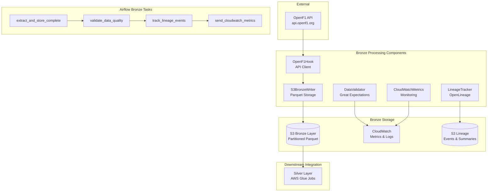
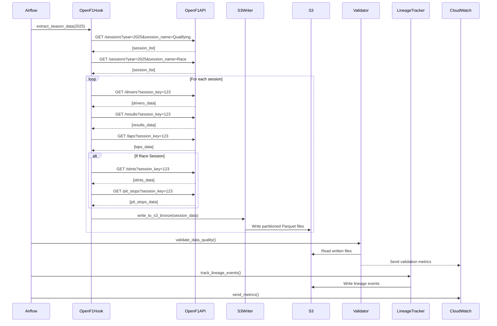
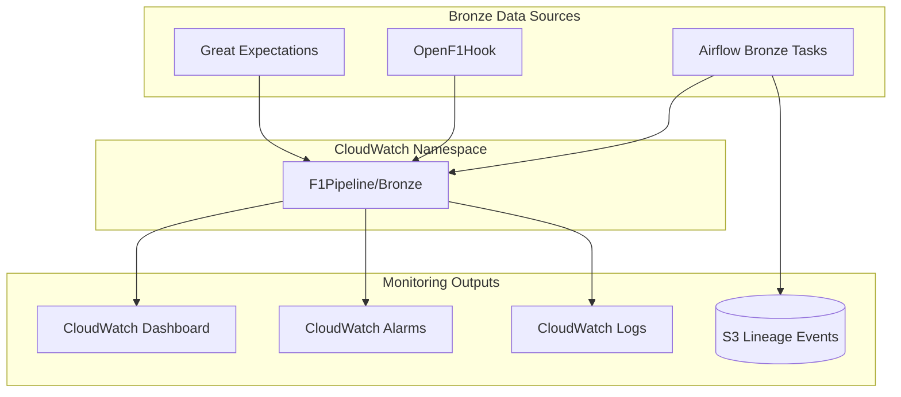

# F1 API Bronze Layer - Technical Implementation Guide

## Table of Contents
1. [Bronze Layer Overview](#bronze-layer-overview)
2. [API Integration Deep Dive](#api-integration-deep-dive)
3. [Data Flow & Processing Logic](#data-flow--processing-logic)
4. [S3 Storage Strategy](#s3-storage-strategy)
5. [Bronze Layer Monitoring](#bronze-layer-monitoring)
6. [Data Quality & Validation](#data-quality--validation)
7. [Lineage Tracking](#lineage-tracking)
8. [Best Practices & Design Decisions](#best-practices--design-decisions)
9. [Troubleshooting & Operations](#troubleshooting--operations)

---

## Bronze Layer Overview

### What is the Bronze Layer?
The Bronze Layer is the **raw data ingestion layer** in our medallion architecture (Bronze → Silver → Gold). It stores data in its original format from the source API with minimal transformation, serving as the **single source of truth** for all downstream processing.

### Role in Complete Pipeline
The Bronze Layer serves as the foundation for the complete F1 data engineering pipeline:
- **Input**: OpenF1 API data extraction
- **Processing**: Minimal transformation (validation, partitioning)
- **Output**: Partitioned Parquet files on S3
- **Integration**: Feeds Silver layer AWS Glue jobs
- **Orchestration**: Managed by both main and historical Airflow DAGs

> 📚 **For complete end-to-end architecture**, see: [F1_END_TO_END_ARCHITECTURE_GUIDE.md](F1_END_TO_END_ARCHITECTURE_GUIDE.md)

### Why OpenF1 API?
We chose the OpenF1 API because it provides:
- **Real-time F1 data** with comprehensive coverage
- **RESTful endpoints** with consistent JSON responses
- **Free access** with reasonable rate limits
- **Rich data model** covering sessions, drivers, results, telemetry

### Bronze Layer Architecture


### OpenF1 API Structure
The OpenF1 API provides F1 data through RESTful endpoints:

**Base URL**: `https://api.openf1.org/v1`

**Key Endpoints**:
- `/sessions` - Session metadata (qualifying, race, practice)
- `/drivers` - Driver information per session
- `/results` - Session results (positions, times, points)
- `/laps` - Individual lap data with telemetry
- `/stints` - Tire stint information (race only)
- `/pit_stops` - Pit stop data (race only)

### API Client Implementation (`OpenF1Hook`)

#### Why We Built a Custom Hook
Instead of using simple `requests`, we built `OpenF1Hook` because:
1. **Rate Limiting**: API has limits, we need controlled access
2. **Retry Logic**: Network failures are common, need resilience
3. **Error Handling**: Graceful degradation for partial failures
4. **Logging**: Comprehensive tracking for debugging
5. **Session Management**: Efficient connection reuse

#### Rate Limiting Strategy
```python
def _enforce_rate_limit(self) -> None:
    """Enforce 0.2 seconds between requests (5 requests/second)"""
    current_time = time.time()
    time_since_last_request = current_time - self.last_request_time
    
    if time_since_last_request < self.rate_limit_seconds:
        sleep_time = self.rate_limit_seconds - time_since_last_request
        time.sleep(sleep_time)
    
    self.last_request_time = time.time()
```

**Why 0.2 seconds?**
- API allows ~5 requests/second
- Provides buffer for network latency
- Prevents 429 (Too Many Requests) errors
- Balances speed vs. reliability

#### Retry Strategy with Exponential Backoff
```python
retry_strategy = Retry(
    total=3,                    # Maximum 3 retries
    backoff_factor=1,          # 1s, 2s, 4s delays
    status_forcelist=[429, 500, 502, 503, 504],  # Retry on these HTTP codes
    allowed_methods=["GET"]     # Only retry GET requests
)
```

**Why This Strategy?**
- **Exponential backoff** prevents overwhelming the API during issues
- **Status codes** target temporary failures, not permanent errors
- **Limited retries** prevent infinite loops
- **GET only** ensures idempotent operations

#### Session Discovery Logic
```python
def _discover_sessions(self, year: int) -> List[Dict]:
    """Discover Qualifying and Race sessions for target year"""
    target_session_types = ["Qualifying", "Race"]
    all_sessions = []
    
    for session_type in target_session_types:
        sessions = self._make_api_request(
            "sessions",
            params={"year": year, "session_name": session_type}
        )
        all_sessions.extend(sessions)
    
    return [s for s in all_sessions if self._validate_session_data(s)]
```

**Why Filter Session Types?**
- **Focus on core data**: Qualifying and Race are most valuable
- **Reduce complexity**: Avoid practice sessions with inconsistent data
- **Performance**: Fewer API calls and storage requirements
- **Business value**: These sessions drive championship outcomes

#### Data Extraction Flow
```python
def _extract_session_data(self, session: Dict) -> Dict:
    """Extract complete data for a single session"""
    # Universal endpoints (all session types)
    universal_endpoints = ["drivers", "session_result", "laps"]
    
    # Race-specific endpoints
    race_endpoints = ["stints", "pit"] if session_type == "Race" else []
    
    # Extract each endpoint with error handling
    for endpoint in universal_endpoints + race_endpoints:
        try:
            data = self._make_api_request(endpoint, {"session_key": session_key})
            extracted_data[endpoint] = data
        except Exception as e:
            # Store empty list for failed extractions
            extracted_data[endpoint] = []
            logger.error(f"Failed {endpoint}: {e}")
```

**Why This Approach?**
- **Graceful degradation**: Continue if some endpoints fail
- **Session-aware**: Different data for qualifying vs race
- **Comprehensive**: Extract all available data types
- **Error isolation**: One endpoint failure doesn't break others

---

## Data Flow & Processing Logic

### End-to-End Data Flow


### Processing Logic Breakdown

#### 1. Session Discovery Phase
```python
# Target: Find all 2025 Qualifying and Race sessions
sessions = []
for session_type in ["Qualifying", "Race"]:
    api_sessions = api_client.get_sessions(year=2025, session_name=session_type)
    sessions.extend(api_sessions)

# Expected: ~25 races × 2 session types = ~50 sessions
```

#### 2. Data Extraction Phase
```python
for session in sessions:
    session_data = {
        "session_metadata": session,
        "drivers": [],      # ~20 drivers per session
        "session_result": [],      # ~20 results per session
        "laps": [],         # ~1000-2000 laps per session
        "stints": [],       # ~40-60 stints per race (race only)
        "pit": []     # ~40-80 pit stops per race (race only)
    }
```

#### 3. Data Volume Expectations
| Data Type | Qualifying Session | Race Session | Total per Season |
|-----------|-------------------|--------------|------------------|
| Sessions | 1 record | 1 record | ~50 records |
| Drivers | ~20 records | ~20 records | ~1,000 records |
| Results | ~20 records | ~20 records | ~1,000 records |
| Laps | ~300 records | ~1,500 records | ~45,000 records |
| Stints | 0 records | ~60 records | ~1,500 records |
| Pit Stops | 0 records | ~80 records | ~2,000 records |

**Total: ~50,000 records per season**
---

#
# S3 Storage Strategy

### Why Partitioned Storage?
Partitioning provides:
1. **Query Performance**: Only scan relevant partitions
2. **Cost Optimization**: Pay only for data you query
3. **Parallel Processing**: Multiple workers can process different partitions
4. **Data Organization**: Logical grouping for maintenance

### Partition Strategy
```
s3://f1-data-lake/bronze/
├── sessions/
│   └── year=2025/
│       ├── grand_prix=bahrain/
│       │   ├── session_type=qualifying/
│       │   │   └── sessions_9158.parquet
│       │   └── session_type=race/
│       │       └── sessions_9159.parquet
│       └── grand_prix=saudi_arabian/
│           ├── session_type=qualifying/
│           └── session_type=race/
├── drivers/
│   └── year=2025/grand_prix=bahrain/session_type=qualifying/
│       └── drivers_9158.parquet
├── results/
├── laps/
├── stints/
└── pit_stops/
```

### Why This Partition Structure?
1. **Year**: Enables multi-year analysis and archival
2. **Grand Prix**: Most common query filter (race-specific analysis)
3. **Session Type**: Separates qualifying vs race data
4. **Data Type**: Separate folders for different data types

### Grand Prix Name Normalization
```python
def normalize_grand_prix_name(meeting_name: str) -> str:
    """Convert 'Bahrain Grand Prix' -> 'bahrain'"""
    # Remove 'Grand Prix' suffix
    normalized = re.sub(r'(\s+|^)grand\s+prix$', '', meeting_name, flags=re.IGNORECASE)
    
    # Handle international characters (São Paulo -> sao_paulo)
    normalized = unicodedata.normalize('NFD', normalized)
    normalized = ''.join(c for c in normalized if unicodedata.category(c) != 'Mn')
    
    # Convert to lowercase with underscores
    normalized = re.sub(r'[^\w\s]', '', normalized.lower())
    normalized = re.sub(r'\s+', '_', normalized.strip())
    
    return normalized
```

**Why Normalize Names?**
- **Consistency**: Avoid issues with spaces and special characters
- **URL Safety**: Safe for S3 keys and file paths
- **Query Compatibility**: Works with SQL engines like Athena
- **International Support**: Handles accented characters

### Parquet Configuration
```python
PARQUET_SETTINGS = {
    'compression': 'snappy',      # Fast compression/decompression
    'engine': 'pyarrow',         # High-performance engine
    'index': False,              # No pandas index in files
    'row_group_size': 50000      # Optimized for F1 data patterns
}
```

**Why These Settings?**
- **Snappy compression**: 70% size reduction with fast read/write
- **PyArrow engine**: Better performance than fastparquet
- **No index**: Reduces file size, not needed for analytics
- **50K row groups**: Optimal for F1 data volumes and query patterns

### File Naming Convention
```python
filename = f"{data_type}_{session_key}.parquet"
# Examples:
# drivers_9158.parquet
# laps_9159.parquet
# pit_stops_9159.parquet
```

**Why Include Session Key?**
- **Uniqueness**: Prevents file overwrites
- **Traceability**: Easy to trace back to source session
- **Debugging**: Identify problematic sessions quickly
- **Reprocessing**: Safe to rerun without conflicts

---

## Bronze Layer Monitoring

### Bronze-Specific Monitoring Strategy
The Bronze layer implements comprehensive monitoring focused on API extraction and raw data validation:

#### Monitoring Components
- **API Extraction Metrics**: Sessions processed, records extracted, API call counts
- **Data Quality Metrics**: Validation results, schema compliance  
- **Lineage Tracking**: OpenLineage events for Bronze layer operations
- **Error Tracking**: Failed extractions, retry attempts, error rates
- **Performance Metrics**: Extraction time, API response times

### CloudWatch Integration for Bronze Layer


### Bronze Layer Metrics (F1Pipeline/Bronze)
```python
BRONZE_METRICS = [
    {
        'MetricName': 'SessionsProcessed',
        'Value': sessions_count,
        'Unit': 'Count',
        'Dimensions': [{'Name': 'Environment', 'Value': 'production'}]
    },
    {
        'MetricName': 'TotalRecordsExtracted',
        'Value': total_records,
        'Unit': 'Count'
    },
    {
        'MetricName': 'BronzeProcessingTime',
        'Value': processing_seconds,
        'Unit': 'Seconds'
    },
    {
        'MetricName': 'APIRequestCount',
        'Value': api_requests_made,
        'Unit': 'Count'
    },
    {
        'MetricName': 'DataValidationFailures',
        'Value': validation_failures,
        'Unit': 'Count'
    },
    {
        'MetricName': 'BronzePipelineSuccess',
        'Value': 1,  # Binary: 1=success, 0=failure
        'Unit': 'Count'
    }
]
```

> 📊 **For complete pipeline monitoring** (Bronze + Silver + Gold), see: [F1_END_TO_END_ARCHITECTURE_GUIDE.md](F1_END_TO_END_ARCHITECTURE_GUIDE.md)
```

#### End-to-End Pipeline Metrics (F1Pipeline/DAG/EndToEnd)
```python
END_TO_END_METRICS = [
    {
        'MetricName': 'EndToEndPipelineSuccess',
        'Value': 1,  # Binary: 1=success, 0=failure
        'Unit': 'Count'
    },
    {
        'MetricName': 'SilverTablesCreated',
        'Value': silver_tables_count,
        'Unit': 'Count'
    },
    {
        'MetricName': 'AnalyticsTablesCreated',
        'Value': gold_tables_count,
        'Unit': 'Count'
    },
    {
        'MetricName': 'TotalPipelineExecutionTime',
        'Value': total_execution_seconds,
        'Unit': 'Seconds'
    }
]
```

#### Historical Backfill Metrics (F1Pipeline/DAG/Historical)
```python
HISTORICAL_METRICS = [
    {
        'MetricName': 'HistoricalPipelineSuccess',
        'Value': 1,
        'Unit': 'Count',
        'Dimensions': [{'Name': 'BackfillType', 'Value': 'end_to_end'}]
    },
    {
        'MetricName': 'HistoricalSessionsProcessed',
        'Value': historical_sessions,
        'Unit': 'Count'
    },
    {
        'MetricName': 'BackfillExecutionTime',
        'Value': backfill_duration,
        'Unit': 'Seconds'
    }
]
```

### Metric Dimensions & Organization
```python
# Standard dimensions across all metrics
STANDARD_DIMENSIONS = [
    {'Name': 'Environment', 'Value': 'production'},     # dev/staging/production
    {'Name': 'Pipeline', 'Value': 'f1_end_to_end'},     # Pipeline identifier
    {'Name': 'Layer', 'Value': 'bronze'},               # bronze/silver/gold
    {'Name': 'DataType', 'Value': 'drivers'},           # drivers/results/laps/etc
    {'Name': 'SessionType', 'Value': 'qualifying'}      # qualifying/race
]

# DAG-specific dimensions
DAG_DIMENSIONS = [
    {'Name': 'DAGType', 'Value': 'main'},               # main/historical
    {'Name': 'TriggerType', 'Value': 'scheduled'},      # scheduled/manual
    {'Name': 'BackfillType', 'Value': 'end_to_end'}     # For historical DAG
]
```

### CloudWatch Alarms & Alerting
```python
# Critical Pipeline Failure Alarm
PIPELINE_FAILURE_ALARM = {
    "AlarmName": "F1-EndToEnd-Pipeline-Failure",
    "MetricName": "EndToEndPipelineSuccess",
    "Namespace": "F1Pipeline/DAG/EndToEnd",
    "Statistic": "Sum",
    "Period": 3600,  # 1 hour
    "EvaluationPeriods": 1,
    "Threshold": 1,
    "ComparisonOperator": "LessThanThreshold",
    "AlarmActions": ["arn:aws:sns:us-east-1:123456789:f1-alerts"]
}

# High Silver/Gold Processing Time Alarm
PROCESSING_TIME_ALARM = {
    "AlarmName": "F1-High-Processing-Time",
    "MetricName": "TotalPipelineExecutionTime",
    "Namespace": "F1Pipeline/DAG/EndToEnd",
    "Statistic": "Average",
    "Period": 3600,
    "EvaluationPeriods": 1,
    "Threshold": 7200,  # 2 hours
    "ComparisonOperator": "GreaterThanThreshold"
}

# Historical Backfill Monitoring
BACKFILL_MONITORING_ALARM = {
    "AlarmName": "F1-Historical-Backfill-Failure",
    "MetricName": "HistoricalPipelineSuccess",
    "Namespace": "F1Pipeline/DAG/Historical",
    "Statistic": "Sum",
    "Period": 3600,
    "EvaluationPeriods": 1,
    "Threshold": 1,
    "ComparisonOperator": "LessThanThreshold"
}
```

### Where to Monitor Your Pipeline

#### 1. Airflow UI (http://localhost:8080)
- **DAG Overview**: Both main and historical DAG status
- **Task Logs**: Detailed Bronze layer processing logs
- **Task Duration**: Bronze task performance tracking
- **XCom Values**: Data passed between tasks
- **Manual Triggers**: Start historical backfill jobs

#### 2. AWS Glue Console
- **Job Runs**: Silver and Gold Glue job execution status
- **Job Metrics**: Worker utilization, memory usage
- **Job Logs**: Detailed Spark processing logs
- **Data Catalog**: Iceberg table schemas and metadata

#### 3. AWS CloudWatch
- **Metrics Dashboard**: Complete pipeline health overview
- **Custom Dashboards**: Layer-specific performance metrics
- **Log Groups**: Centralized logging across all components
- **Alarms**: Real-time failure notifications

#### 4. S3 Console
- **Bronze Data**: Raw Parquet files with partition structure
- **Silver Tables**: Iceberg table files and metadata
- **Gold Tables**: Analytics-ready Iceberg tables
- **Lineage Events**: OpenLineage JSON events for data tracking

### Monitoring Best Practices

#### Structured Logging
```python
# Enhanced logging with pipeline context
logger.info(
    "End-to-end pipeline execution complete",
    extra={
        "pipeline_type": "main",  # or "historical"
        "dag_run_id": context['run_id'],
        "sessions_processed": bronze_sessions,
        "silver_tables_created": silver_tables,
        "gold_tables_created": gold_tables,
        "total_execution_time_seconds": total_time,
        "layers_completed": ["bronze", "silver", "gold"]
    }
)
```

#### Performance Tracking
```python
# Track layer-specific performance
LAYER_PERFORMANCE_METRICS = {
    'bronze_processing_time': bronze_duration,
    'silver_processing_time': silver_duration,
    'gold_processing_time': gold_duration,
    'end_to_end_efficiency': gold_tables / bronze_sessions,
    'data_amplification_ratio': total_gold_records / bronze_records
}
```

#### 1. CloudWatch Console
- **Metrics**: `AWS Console → CloudWatch → Metrics → F1Pipeline/Bronze`
- **Logs**: `AWS Console → CloudWatch → Log Groups → /aws/airflow/f1_bronze_pipeline`
- **Alarms**: `AWS Console → CloudWatch → Alarms`

#### 2. Airflow UI
- **DAG Runs**: `http://airflow-url/admin/airflow/graph?dag_id=f1_bronze_pipeline`
- **Task Logs**: Click on individual tasks to view detailed logs
- **XCom Data**: View data passed between tasks

#### 3. Custom Dashboards
```json
{
    "widgets": [
        {
            "type": "metric",
            "properties": {
                "metrics": [
                    ["F1Pipeline/Bronze", "SessionsProcessed"],
                    ["F1Pipeline/Bronze", "TotalRecordsExtracted"],
                    ["F1Pipeline/Bronze", "PipelineExecutionTime"]
                ],
                "period": 3600,
                "stat": "Sum",
                "region": "us-east-1",
                "title": "F1 Bronze Pipeline Metrics"
            }
        }
    ]
}
```---


## Data Quality & Validation

### Why Data Validation?
1. **Early Detection**: Catch issues before they propagate downstream
2. **Data Trust**: Ensure data meets business requirements
3. **Debugging**: Identify root causes of data issues
4. **Compliance**: Meet data governance requirements

### Great Expectations Integration
We use Great Expectations because:
- **Industry Standard**: Widely adopted data validation framework
- **Rich Assertions**: Comprehensive validation rules
- **Reporting**: Detailed validation reports
- **Integration**: Works well with pandas/Spark

### Validation Rules by Data Type

#### Universal Validations (All Data Types)
```python
UNIVERSAL_VALIDATIONS = [
    "expect_table_row_count_to_be_between(min_value=1)",
    "expect_table_columns_to_match_ordered_list(expected_columns)",
    "expect_column_values_to_not_be_null('session_key')"
]
```

#### Drivers Data Validations
```python
DRIVERS_VALIDATIONS = [
    "expect_column_values_to_not_be_null('driver_number')",
    "expect_column_values_to_be_between('driver_number', min_value=1, max_value=99)",
    "expect_column_values_to_not_be_null('full_name')",
    "expect_column_values_to_match_regex('name_acronym', r'^[A-Z]{3}$')"  # 3-letter codes
]
```

#### Results Data Validations
```python
RESULTS_VALIDATIONS = [
    "expect_column_values_to_be_between('position', min_value=1, max_value=20)",
    "expect_column_values_to_not_be_null('position')",
    "expect_column_values_to_be_of_type('points', 'int64')",
    "expect_column_values_to_be_between('points', min_value=0, max_value=26)"  # Max F1 points
]
```

#### Laps Data Validations
```python
LAPS_VALIDATIONS = [
    "expect_column_values_to_not_be_null('lap_time')",
    "expect_column_values_to_be_of_type('lap_time', 'float64')",
    "expect_column_values_to_be_between('lap_number', min_value=1, max_value=100)",
    "expect_column_values_to_match_regex('lap_time', r'^\d+\.\d+$')"  # Numeric format
]
```

#### Stints Data Validations (Race Only)
```python
STINTS_VALIDATIONS = [
    "expect_column_values_to_not_be_null('compound')",
    "expect_column_values_to_be_in_set('compound', ['SOFT', 'MEDIUM', 'HARD', 'INTERMEDIATE', 'WET'])",
    "expect_column_values_to_be_between('stint_number', min_value=1, max_value=10)"
]
```

#### Pit Stops Data Validations (Race Only)
```python
PIT_STOPS_VALIDATIONS = [
    "expect_column_values_to_not_be_null('pit_duration')",
    "expect_column_values_to_be_of_type('pit_duration', 'float64')",
    "expect_column_values_to_be_between('pit_duration', min_value=1.0, max_value=60.0)"  # Reasonable pit stop times
]
```

---

## Lineage Tracking

### Why Data Lineage?
Data lineage provides:
1. **Traceability**: Track data from source to destination
2. **Impact Analysis**: Understand downstream effects of changes
3. **Debugging**: Identify root causes of data issues
4. **Compliance**: Meet regulatory requirements for data governance
5. **Documentation**: Automatic documentation of data flows

### OpenLineage Standard
We use OpenLineage because:
- **Industry Standard**: CNCF project with wide adoption
- **Tool Agnostic**: Works with any processing engine
- **Rich Metadata**: Comprehensive data about jobs and datasets
- **Event-Driven**: Real-time lineage tracking

### Lineage Event Structure
```json
{
    "eventType": "COMPLETE",
    "eventTime": "2025-01-15T10:30:00.000Z",
    "run": {
        "runId": "f1_bronze_pipeline_20250115_103000",
        "facets": {
            "nominalTime": {
                "nominalStartTime": "2025-01-15T06:00:00.000Z"
            }
        }
    },
    "job": {
        "namespace": "f1-pipeline",
        "name": "bronze_extraction",
        "facets": {
            "documentation": {
                "description": "Extract F1 2025 season data from OpenF1 API to S3 Bronze layer"
            }
        }
    },
    "inputs": [
        {
            "namespace": "openf1-api",
            "name": "sessions_endpoint",
            "facets": {
                "dataSource": {
                    "name": "openf1-api",
                    "uri": "https://api.openf1.org/v1/sessions"
                },
                "schema": {
                    "fields": [
                        {"name": "session_key", "type": "integer"},
                        {"name": "session_name", "type": "string"},
                        {"name": "date_start", "type": "timestamp"}
                    ]
                }
            }
        }
    ],
    "outputs": [
        {
            "namespace": "s3://f1-data-lake",
            "name": "sessions_bronze",
            "facets": {
                "dataSource": {
                    "name": "s3-bronze-layer",
                    "uri": "s3://f1-data-lake/bronze/sessions/year=2025/grand_prix=bahrain/session_type=qualifying/"
                },
                "stats": {
                    "rowCount": 1,
                    "size": 2048
                },
                "schema": {
                    "fields": [
                        {"name": "session_key", "type": "integer"},
                        {"name": "session_name", "type": "string"},
                        {"name": "date_start", "type": "timestamp"},
                        {"name": "meeting_name", "type": "string"}
                    ]
                }
            }
        }
    ]
}
```

### Lineage Storage Structure
```
s3://f1-data-lake/lineage/
├── events/
│   └── year=2025/
│       └── month=01/
│           └── day=15/
│               ├── event_f1_bronze_pipeline_20250115_103000_drivers.json
│               ├── event_f1_bronze_pipeline_20250115_103000_results.json
│               └── event_f1_bronze_pipeline_20250115_103000_laps.json
└── summaries/
    └── year=2025/
        └── month=01/
            └── day=15/
                └── lineage_summary_20250115.parquet
```

### Querying Lineage Data
```sql
-- Find all data sources for a specific output
SELECT 
    job.name as job_name,
    input.namespace as source_namespace,
    input.name as source_name,
    output.name as target_name,
    eventTime
FROM lineage_events
WHERE output.name = 'drivers_bronze'
ORDER BY eventTime DESC;

-- Track data flow for a specific session
SELECT 
    job.name,
    input.uri as source_uri,
    output.uri as target_uri,
    output.facets.stats.rowCount as records
FROM lineage_events
WHERE output.uri LIKE '%session_key=9158%'
ORDER BY eventTime;
```

---

## Best Practices & Design Decisions

### 1. API Client Design Patterns

#### Retry Strategy with Circuit Breaker Pattern
```python
class OpenF1Hook:
    def __init__(self):
        self.failure_count = 0
        self.circuit_open = False
        self.last_failure_time = None
        
    def _make_api_request(self, url):
        # Check circuit breaker
        if self.circuit_open:
            if time.time() - self.last_failure_time > 300:  # 5 minutes
                self.circuit_open = False
                self.failure_count = 0
            else:
                raise Exception("Circuit breaker open")
        
        try:
            response = self.session.get(url)
            self.failure_count = 0  # Reset on success
            return response
        except Exception as e:
            self.failure_count += 1
            if self.failure_count >= 5:
                self.circuit_open = True
                self.last_failure_time = time.time()
            raise
```

**Why Circuit Breaker?**
- **Fail Fast**: Don't waste time on broken services
- **Resource Protection**: Prevent overwhelming failing APIs
- **Automatic Recovery**: Resume when service recovers

#### Connection Pooling
```python
def _create_session(self):
    session = requests.Session()
    
    # Configure connection pooling
    adapter = HTTPAdapter(
        pool_connections=10,    # Number of connection pools
        pool_maxsize=20,       # Max connections per pool
        max_retries=retry_strategy
    )
    
    session.mount("http://", adapter)
    session.mount("https://", adapter)
    
    return session
```

**Why Connection Pooling?**
- **Performance**: Reuse TCP connections
- **Resource Efficiency**: Limit concurrent connections
- **Scalability**: Handle multiple requests efficiently

### 2. Storage Optimization Patterns

#### Columnar Storage Benefits
```python
# Parquet advantages for F1 data:
# 1. Column pruning - only read needed columns
# 2. Predicate pushdown - filter at storage level
# 3. Compression - 70% size reduction
# 4. Schema evolution - add columns without breaking queries

# Example query optimization:
SELECT driver_number, lap_time 
FROM laps 
WHERE session_key = 9158 
  AND lap_number BETWEEN 10 AND 20;

# Parquet only reads 'driver_number' and 'lap_time' columns
# Filters applied at file level before loading data
```

#### Partition Pruning
```python
# Query with partition pruning:
SELECT * FROM drivers 
WHERE year = 2025 
  AND grand_prix = 'bahrain' 
  AND session_type = 'qualifying';

# Only scans: s3://bucket/bronze/drivers/year=2025/grand_prix=bahrain/session_type=qualifying/
# Ignores all other partitions - massive performance gain
```

### 3. Error Handling Patterns

#### Graceful Degradation
```python
def extract_session_data(self, session):
    """Extract data with graceful degradation"""
    extracted_data = {"session_metadata": session}
    
    # Critical data - fail if missing
    critical_endpoints = ["drivers", "session_result"]
    
    # Optional data - continue if missing
    optional_endpoints = ["laps", "stints", "pit"]
    
    for endpoint in critical_endpoints:
        try:
            data = self._make_api_request(endpoint, {"session_key": session_key})
            extracted_data[endpoint] = data
        except Exception as e:
            logger.error(f"Critical endpoint {endpoint} failed: {e}")
            raise  # Fail the entire extraction
    
    for endpoint in optional_endpoints:
        try:
            data = self._make_api_request(endpoint, {"session_key": session_key})
            extracted_data[endpoint] = data
        except Exception as e:
            logger.warning(f"Optional endpoint {endpoint} failed: {e}")
            extracted_data[endpoint] = []  # Continue with empty data
    
    return extracted_data
```

#### Idempotent Operations
```python
def write_to_s3_bronze(session_data, data_type, config):
    """Idempotent S3 write operation"""
    # Generate deterministic file path
    file_path = generate_partition_path(session_data, data_type)
    
    # Check if file already exists with same content
    if file_exists_and_valid(file_path, session_data):
        logger.info(f"File already exists and valid: {file_path}")
        return {"success": True, "message": "File already exists"}
    
    # Write new file (overwrites existing)
    df.to_parquet(file_path, **PARQUET_SETTINGS)
    
    return {"success": True, "message": "File written successfully"}
```

---

## Troubleshooting & Operations

### Common Issues and Solutions

#### 1. API Rate Limiting (429 Errors)
**Symptoms**: 
- HTTP 429 "Too Many Requests" errors
- Slow extraction performance
- Intermittent failures

**Root Causes**:
- Rate limit too aggressive (< 0.2 seconds)
- Multiple concurrent DAG runs
- API service degradation

**Solutions**:
```python
# Increase rate limiting
api_client = OpenF1Hook(rate_limit_seconds=0.5)  # Slower but more reliable

# Add jitter to prevent thundering herd
import random
sleep_time = rate_limit_seconds + random.uniform(0, 0.1)
time.sleep(sleep_time)

# Implement exponential backoff
for attempt in range(max_retries):
    try:
        response = make_request()
        break
    except RateLimitError:
        wait_time = (2 ** attempt) + random.uniform(0, 1)
        time.sleep(wait_time)
```

#### 2. S3 Write Failures
**Symptoms**:
- "Access Denied" errors
- "Bucket does not exist" errors
- Partial data in S3

**Root Causes**:
- Incorrect IAM permissions
- Bucket name typos in configuration
- Network connectivity issues

**Solutions**:
```python
# Validate S3 access before processing
def validate_s3_access(bucket_name):
    try:
        s3_client = boto3.client('s3')
        s3_client.head_bucket(Bucket=bucket_name)
        
        # Test write permissions
        test_key = f"test/{datetime.now().isoformat()}.txt"
        s3_client.put_object(Bucket=bucket_name, Key=test_key, Body=b"test")
        s3_client.delete_object(Bucket=bucket_name, Key=test_key)
        
        return True
    except Exception as e:
        logger.error(f"S3 access validation failed: {e}")
        return False
```

#### 3. Memory Issues with Large Datasets
**Symptoms**:
- "Out of Memory" errors
- Slow processing performance
- Container/worker crashes

**Solutions**:
```python
# Process sessions one at a time
def extract_season_data_streaming(year):
    sessions = discover_sessions(year)
    
    for session in sessions:
        # Extract and process immediately
        session_data = extract_session_data(session)
        write_session_to_s3(session_data)
        
        # Clear memory
        del session_data
        gc.collect()
```

### Operational Runbooks

#### Daily Operations Checklist
1. **Check Pipeline Status**
   - Verify last DAG run completed successfully
   - Check CloudWatch metrics for anomalies
   - Review error logs for any warnings

2. **Data Quality Validation**
   - Verify expected number of sessions processed
   - Check record counts match expectations
   - Review validation failure reports

3. **Storage Monitoring**
   - Check S3 bucket size growth
   - Verify partition structure is correct
   - Monitor storage costs

#### Emergency Response Procedures

#### Pipeline Failure Response
1. **Immediate Actions** (0-15 minutes)
   - Check Airflow UI for failed tasks
   - Review CloudWatch logs for error details
   - Determine if issue is transient or systemic

2. **Investigation** (15-60 minutes)
   - Identify root cause (API, S3, configuration, etc.)
   - Check if issue affects other systems
   - Document findings and timeline

3. **Resolution** (1-4 hours)
   - Implement fix based on root cause
   - Test fix in development environment
   - Deploy fix and restart pipeline
   - Monitor for successful completion

4. **Post-Incident** (1-7 days)
   - Conduct post-mortem review
   - Update monitoring and alerting
   - Implement preventive measures
   - Update documentation and runbooks

---

## Summary

This comprehensive guide covers the F1 API Bronze Layer implementation from technical architecture to operational procedures. The system demonstrates modern data engineering best practices including:

- **Production-ready API integration** with proper rate limiting and error handling
- **Optimized storage strategy** using partitioned Parquet files
- **Comprehensive monitoring** with CloudWatch metrics and lineage tracking
- **Data quality validation** using Great Expectations
- **Operational excellence** with detailed troubleshooting guides

The Bronze Layer serves as the foundation for the entire F1 data pipeline, providing reliable, well-structured raw data for downstream Silver and Gold layer transformations.

📚 Comprehensive Coverage
1. API Integration Deep Dive
OpenF1 API structure and endpoints explanation
Custom API client (OpenF1Hook) with rate limiting (0.2s between requests)
Retry strategy with exponential backoff (1s, 2s, 4s delays)
Session discovery logic for Qualifying and Race sessions
Error handling patterns with graceful degradation
2. Data Flow & Processing Logic
End-to-end sequence diagrams showing complete data flow
Session discovery phase (finding ~50 sessions per season)
Data extraction phase with volume expectations (~50,000 records/season)
Processing breakdown by data type (drivers, results, laps, stints, pit_stops)
3. S3 Storage Strategy
Partitioning strategy explained: year=2025/grand_prix=bahrain/session_type=qualifying/
Why this partition structure (query performance, cost optimization)
Grand Prix name normalization (handling international characters)
Parquet configuration (Snappy compression, 50K row groups, PyArrow engine)
File naming conventions with session keys for uniqueness
4. Airflow Orchestration
DAG design philosophy (static, linear tasks)
Schedule reasoning (Monday 6 AM after race weekends)
Task architecture with detailed explanations:
Extract and Store Complete
Validate Data Quality
Track Lineage Events
Send CloudWatch Metrics
XCom data flow between tasks
5. Monitoring & Observability
CloudWatch integration with specific metrics
Key metrics tracked (sessions processed, records extracted, execution time)
Metric dimensions (Environment, DataType, SessionType)
CloudWatch alarms configuration
Where to view data: CloudWatch Console, Airflow UI, Custom Dashboards
6. Data Quality & Validation
Great Expectations integration with validation rules
Data type specific validations:
Drivers: driver numbers 1-99, 3-letter acronyms
Results: positions 1-20, points 0-26
Laps: numeric lap times, lap numbers 1-100
Stints: tire compounds validation
Pit Stops: reasonable pit stop durations
7. Lineage Tracking
OpenLineage standard implementation
Event structure with complete JSON examples
Storage organization in S3 lineage partitions
Querying lineage data with SQL examples
8. Best Practices & Design Decisions
Circuit breaker pattern for API resilience
Connection pooling for performance
Columnar storage benefits (70% compression, column pruning)
Partition pruning for query optimization
Graceful degradation strategies
Idempotent operations for reliability
9. Troubleshooting & Operations
Common issues and solutions:
API rate limiting (429 errors)
S3 write failures
Memory issues with large datasets
Operational runbooks with daily checklists
Emergency response procedures with timelines
Monitoring setup and alerting configuration
🔧 Tools & Technologies Explained
Why Each Tool Was Chosen:
OpenF1 API: Real-time F1 data with comprehensive coverage
Apache Airflow: Workflow orchestration with retry logic
AWS S3: Scalable object storage with partitioning
Apache Parquet: Columnar format with compression
Great Expectations: Industry-standard data validation
OpenLineage: CNCF standard for data lineage
CloudWatch: Native AWS monitoring and alerting
Integration Patterns:
Rate limiting: 0.2 seconds between API requests
Retry strategy: 3 retries with exponential backoff
Partitioning: Hive-style partitioning for query optimization
Compression: Snappy compression for 70% size reduction
Monitoring: Real-time metrics with automated alerting
📊 Data Engineering Best Practices
Performance Optimization:
Connection pooling for API efficiency
Memory management with streaming processing
Batch processing grouped by Grand Prix
Partition pruning for query performance
Reliability Patterns:
Circuit breaker for API failures
Graceful degradation for partial failures
Idempotent operations for safe retries
Comprehensive error handling with context
Observability:
Structured logging with context
Comprehensive metrics tracking
Data lineage for traceability
Automated alerting for failures