# F1 Data Engineering Pipeline - Complete End-to-End Architecture Guide

## Table of Contents
1. [Overview & Complete Architecture](#overview--complete-architecture)
2. [Airflow DAG Architecture](#airflow-dag-architecture)
3. [Medallion Architecture Implementation](#medallion-architecture-implementation)
4. [End-to-End Data Flow](#end-to-end-data-flow)
5. [Monitoring & Observability](#monitoring--observability)
6. [Deployment & Operations](#deployment--operations)
7. [Layer-Specific Guides](#layer-specific-guides)

---

## Overview & Complete Architecture

### Project Overview
This F1 Data Engineering Pipeline demonstrates modern data engineering practices by implementing a complete **medallion architecture (Bronze → Silver → Gold)** using AWS cloud services and Apache Airflow orchestration.

### Core Value Proposition
- **Scalable Data Processing**: Handle Formula 1 session data (Qualifying and Race)
- **Modern Architecture**: Complete medallion architecture with proper layer separation
- **Production-Ready**: AWS Glue jobs with built-in monitoring and validation
- **Flexible Orchestration**: Two complementary DAGs for operational vs backfill needs

### Technology Stack
- **Orchestration**: Apache Airflow 2.7.2 (TaskFlow API)
- **Data Processing**: AWS Glue 4.0 with Apache Spark
- **Data Storage**: Apache Iceberg tables on S3
- **Data Catalog**: AWS Glue Catalog
- **Monitoring**: CloudWatch + Great Expectations + OpenLineage
- **Query Engine**: AWS Athena

### Complete Architecture Overview


---

## Airflow DAG Architecture

### DAG Design Philosophy
We implemented **two complementary DAGs** with **REUSE strategy**:
- **Single End-to-End DAG**: Complete pipeline orchestration
- **Separate Historical DAG**: Dedicated backfill workflow  
- **Same Glue Jobs**: Reused across both DAGs (no code duplication)
- **TaskFlow API**: Modern Airflow `@task` decorators for clean code

### 1. Main End-to-End DAG (`f1_end_to_end_pipeline`)

#### Purpose & Scheduling
- **Scheduled**: Weekly Monday 6 AM after race weekends
- **Purpose**: Current data processing through complete medallion architecture
- **Approach**: Simple orchestration leveraging built-in Glue job capabilities

#### DAG Flow Architecture


#### Key Task Implementation
```python
# Bronze Layer Tasks (Custom @task functions)
@task(task_id='extract_api_data')
def extract_f1_api_data(**context):
    """REUSE existing Bronze extraction logic"""
    from dags.f1_bronze_pipeline import extract_and_store_complete_task
    return extract_and_store_complete_task(**context)

# Silver Layer (AWS Glue Job)
trigger_silver_job = GlueJobOperator(
    task_id='trigger_silver_transformation',
    job_name='f1-bronze-to-silver-transform',  # REUSE existing job
    create_job_kwargs={
        'GlueVersion': '4.0',
        'NumberOfWorkers': 10,
        'WorkerType': 'G.1X'
    }
)

# Gold Layer (AWS Glue Job)
trigger_gold_job = GlueJobOperator(
    task_id='trigger_gold_analytics',
    job_name='f1-silver-to-gold-transform',  # REUSE existing job
    create_job_kwargs={
        'GlueVersion': '4.0',
        'NumberOfWorkers': 5,
        'WorkerType': 'G.1X'
    }
)
```

### 2. Historical Backfill DAG (`f1_historical_backfill`)

#### Purpose & Scheduling
- **Manual Trigger**: No schedule, triggered manually from Airflow UI
- **Purpose**: Historical data processing through complete medallion architecture
- **Enhanced**: Longer timeouts and enhanced retry logic for historical data

#### DAG Flow Architecture  


### REUSE Strategy Implementation

#### Why REUSE vs Create New?
✅ **Benefits of REUSING Glue Jobs:**
- **No Code Duplication**: Single source of truth for transformations
- **Easier Maintenance**: One set of jobs to maintain  
- **Consistent Processing**: Same logic for current and historical data
- **Cost Efficient**: No duplicate AWS Glue job resources
- **Resume Project Appropriate**: Shows architectural understanding

#### Architecture Pattern
```python
# Both DAGs use SAME Glue jobs with different task IDs

# Main DAG
trigger_silver_job = GlueJobOperator(
    task_id='trigger_silver_transformation',
    job_name='f1-bronze-to-silver-transform'  # SHARED JOB
)

# Historical DAG  
trigger_silver_job_historical = GlueJobOperator(
    task_id='trigger_silver_transformation_historical',  # Different task ID
    job_name='f1-bronze-to-silver-transform'  # SAME JOB
)
```

### DAG Configuration Comparison

| Aspect | Main DAG | Historical DAG |
|--------|----------|----------------|
| **Schedule** | `0 6 * * 1` (Weekly Monday 6 AM) | `None` (Manual trigger only) |
| **Catchup** | `False` | `False` |
| **Max Active Runs** | `1` | `1` |
| **Retries** | `2` | `3` (Enhanced) |
| **Retry Delay** | `5 minutes` | `10 minutes` (Longer) |
| **Silver Timeout** | `30 minutes` | `40 minutes` (Longer) |
| **Gold Timeout** | `20 minutes` | `30 minutes` (Longer) |
| **Tags** | `['f1', 'end-to-end', 'production']` | `['f1', 'backfill', 'manual', 'historical']` |

---

## Medallion Architecture Implementation

### Layer Overview


### Bronze Layer (Airflow Tasks)
- **Technology**: Custom Python tasks with OpenF1Hook
- **Storage**: Partitioned Parquet files on S3
- **Processing**: Raw data extraction with minimal transformation
- **Validation**: Great Expectations schema validation
- **Monitoring**: CloudWatch metrics and OpenLineage tracking

### Silver Layer (AWS Glue Job)
- **Technology**: AWS Glue 4.0 with Apache Spark
- **Storage**: Apache Iceberg tables for ACID compliance
- **Processing**: Data cleaning, normalization, and schema enforcement
- **Tables Created**: 6 normalized tables (sessions, drivers, results, laps, pitstops)
- **Built-in Features**: Validation, lineage tracking, CloudWatch metrics

### Gold Layer (AWS Glue Job)
- **Technology**: AWS Glue 4.0 with Apache Spark
- **Storage**: Apache Iceberg tables optimized for analytics
- **Processing**: Business logic aggregation and session-specific analytics
- **Tables Created**: 5 session-specific analytics tables
- **Built-in Features**: Validation, lineage tracking, CloudWatch metrics

---

## End-to-End Data Flow

### Complete Pipeline Execution Flow

#### Main DAG Execution (Weekly)

```mermaid
graph TD
    START["⏰ Monday 6 AM Trigger"] --> EXTRACT["🚀 Extract API Data"]
    EXTRACT --> VALIDATE["🔍 Validate Bronze Data"]
    VALIDATE --> SILVER_START["🔄 Trigger Silver Glue Job"]
    SILVER_START --> SILVER_WAIT["⏳ Monitor Silver Job"]
    SILVER_WAIT --> GOLD_START["🔄 Trigger Gold Glue Job"]
    GOLD_START --> GOLD_WAIT["⏳ Monitor Gold Job"]
    GOLD_WAIT --> LINEAGE["🔗 Track End-to-End Lineage"]
    LINEAGE --> METRICS["📊 Send Pipeline Metrics"]
    METRICS --> NOTIFY["📧 Notify Completion"]
    NOTIFY --> END["✅ Pipeline Complete"]
    
    style START fill:#e1f5fe
    style EXTRACT fill:#f3e5f5
    style SILVER_START fill:#e8f5e8
    style GOLD_START fill:#fff3e0
    style END fill:#e8f5e8
```


### Data Volume & Processing Expectations

#### Expected Data Volumes (Per Season)
| Data Type | Bronze Records | Silver Records | Gold Analytics |
|-----------|----------------|----------------|----------------|
| Sessions | ~50 | ~50 | 5 summary tables |
| Drivers | ~1,000 | ~1,000 | Driver performance metrics |
| Results | ~1,000 | ~1,000 | Championship standings |
| Laps | ~45,000 | ~45,000 | Lap time analytics |
| Pitstops | ~2,000 | ~2,000 | Strategy analysis |

#### Processing Time Expectations
- **Bronze Layer**: 5-10 minutes (API extraction)
- **Silver Layer**: 15-25 minutes (Glue job processing)
- **Gold Layer**: 10-15 minutes (Analytics generation)
- **Total Pipeline**: 30-50 minutes end-to-end

---

## Monitoring & Observability

### Multi-Layer Monitoring Strategy


### Key Monitoring Locations

#### 1. Airflow UI (http://localhost:8080)
- **DAG Overview**: Both main and historical DAG status
- **Task Logs**: Detailed Bronze layer processing logs
- **Manual Triggers**: Start historical backfill jobs

#### 2. AWS Glue Console
- **Job Runs**: Silver and Gold Glue job execution status
- **Job Metrics**: Worker utilization, memory usage
- **Data Catalog**: Iceberg table schemas and metadata

#### 3. AWS CloudWatch
- **Metrics Dashboard**: Complete pipeline health overview
- **Custom Dashboards**: Layer-specific performance metrics
- **Alarms**: Real-time failure notifications

#### 4. S3 Console
- **Bronze Data**: Raw Parquet files with partition structure
- **Silver Tables**: Iceberg table files and metadata
- **Gold Tables**: Analytics-ready Iceberg tables

---

## Deployment & Operations

### Development Environment Setup
```bash
# Clone repository
git clone <repository-url>
cd F1-data-engineering-pipeline

# Set up environment variables
cp .env.example .env

# Start development environment
make dev-up

# Access Airflow UI
open http://localhost:8080
```

### Production Deployment
- **Airflow**: Deploy to AWS MWAA (Managed Airflow)
- **Glue Jobs**: Deploy via AWS Glue console or Terraform
- **Monitoring**: CloudWatch dashboards and alarms
- **Security**: IAM roles and permissions for secure operations

### Operational Procedures

#### Weekly Operations (Automated)
1. **Monday 6 AM**: Main DAG triggers automatically
2. **Monitor**: Check CloudWatch dashboard for pipeline health
3. **Validation**: Verify data quality metrics in CloudWatch
4. **Analytics**: QuickSight dashboards updated with latest data

#### Historical Data Operations (Manual)
1. **Trigger**: Start historical DAG from Airflow UI
2. **Monitor**: Enhanced monitoring for longer processing times
3. **Validation**: Check historical data quality and completeness
4. **Integration**: Verify historical data integrates with current analytics

---

## Layer-Specific Guides

For detailed technical implementation of each layer, refer to the dedicated guides:

### 📚 **Detailed Layer Guides**

1. **[Bronze Layer Guide](F1_API_BRONZE_LAYER_GUIDE.md)**
   - OpenF1 API integration details
   - Data extraction and partitioning strategies
   - S3 storage patterns and optimization

2. **[Silver Layer Guide](BRONZE_TO_SILVER_COMPREHENSIVE_GUIDE.md)**
   - AWS Glue job implementation
   - Data cleaning and normalization processes
   - Iceberg table management

3. **[Gold Layer Guide](SILVER_TO_GOLD_BEGINNER_GUIDE.md)**
   - Analytics table creation
   - Business logic implementation
   - Performance optimization techniques

### 🎯 **When to Use Each Guide**

- **Start Here**: This end-to-end guide for overall architecture understanding
- **Bronze Deep Dive**: When implementing API extraction and S3 storage
- **Silver Deep Dive**: When working on data cleaning and normalization
- **Gold Deep Dive**: When creating analytics tables and business logic

---

## Interview Talking Points

### 🎯 **Architecture Decision Points**
- **"Designed complete medallion architecture with proper layer separation"**
- **"Implemented two complementary DAGs for operational vs backfill needs"**
- **"Used REUSE strategy to avoid code duplication while ensuring consistency"**
- **"Leveraged built-in AWS Glue capabilities rather than over-engineering"**
- **"Applied modern Airflow TaskFlow API for cleaner, more maintainable code"**

### 🎯 **Technical Implementation**
- **"Orchestration handles workflow, Glue handles data processing"**
- **"Same transformation jobs serve both scheduled and ad-hoc workflows"**
- **"Enhanced monitoring and retry logic for production reliability"**
- **"Complete end-to-end data lineage and quality validation"**

This architecture demonstrates modern data engineering practices with production-ready patterns suitable for enterprise environments.