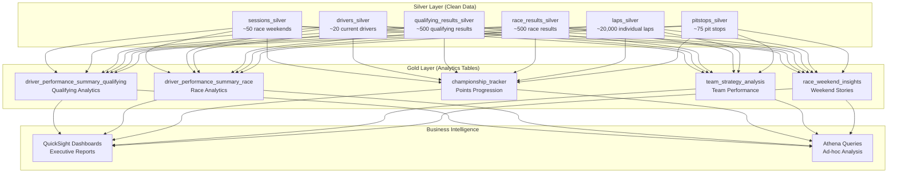

# Silver-to-Gold Analytics (Phase 4) - Complete Beginner's Guide

## 🎯 What Are We Building?

Think of this like creating a **restaurant menu** from raw ingredients:

- **Silver Layer** = Prepped ingredients (clean, organized data tables)
- **Gold Layer** = Ready-to-serve dishes (business analytics tables)
- **Dashboards** = The menu customers see (QuickSight reports)

We're transforming clean F1 data into **5 specialized analytics tables** that answer specific business questions.

---

## 🏗️ Architecture Overview

### The Complete Data Flow



### Why 5 Separate Tables?

**Business Requirement**: Different people need different views of the data:

1. **Race Engineers** → Need qualifying-specific data (grid positions, Q1/Q2/Q3 times)
2. **Team Strategists** → Need race-specific data (pit stops, tire strategies)
3. **Media/Fans** → Need championship progression and weekend summaries
4. **Team Principals** → Need team performance comparisons
5. **Data Scientists** → Need combined datasets for advanced analytics

---

## 🔄 Session-Specific Processing (Core Concept)

### Understanding F1 Sessions

An F1 weekend has different **sessions**:

1. **Practice 1, 2, 3** → Training sessions (we ignore these)
2. **Qualifying** → Determines starting grid positions (Saturday)
3. **Race** → The main event where points are awarded (Sunday)

### Why Session Separation Matters

**❌ Wrong Approach**: Mixing all data together
```sql
-- This would be confusing and meaningless!
SELECT 
    driver_name,
    AVG(position) as avg_position,  -- Mixing qualifying + race positions!
    SUM(points) as total_points     -- Only race has points!
FROM all_results
GROUP BY driver_name;
```

**✅ Correct Approach**: Session-specific processing
```sql
-- Qualifying Analysis (separate table)
SELECT 
    driver_name,
    AVG(qualifying_position) as avg_qualifying_position,
    COUNT(CASE WHEN qualifying_position = 1 THEN 1 END) as pole_positions
FROM driver_performance_summary_qualifying
GROUP BY driver_name;

-- Race Analysis (separate table)  
SELECT 
    driver_name,
    SUM(race_points) as total_points,
    COUNT(CASE WHEN finish_position = 1 THEN 1 END) as wins
FROM driver_performance_summary_race
GROUP BY driver_name;
```

---

## 📊 The 5 Gold Tables Explained

### 1. Driver Performance Summary - Qualifying

**Business Question**: "How good is each driver at qualifying?"

**What It Contains**:
- Qualifying positions and times
- Gap to pole position
- Q3 appearances (top 10 qualifiers)
- Season averages and trends
- Teammate comparisons

**Example Data**:
```
driver_name         | qualifying_position | gap_to_pole | made_q3 | poles_season_total
Max Verstappen      | 1                  | 0.000       | true    | 8
Lewis Hamilton      | 3                  | 0.234       | true    | 2
George Russell      | 4                  | 0.456       | true    | 1
```

**Key Transformation Logic**:
```python
# Filter to qualifying sessions only
sessions_df = silver_data['sessions_silver'].filter(
    col("session_name") == "Qualifying"
)

# Calculate gap to pole position
qualifying_with_pole_df = qualifying_df.join(
    pole_time_df,
    ["year", "grand_prix_name"],
    "left"
).withColumn(
    "gap_to_pole",
    col("qualifying_time") - col("pole_position_time")
)

# Add season progression using window functions
window_spec = Window.partitionBy("driver_number").orderBy("race_date")
df = df.withColumn(
    "season_avg_qualifying_position",
    avg("qualifying_position").over(window_spec)
)
```

### 2. Driver Performance Summary - Race

**Business Question**: "How good is each driver at racing?"

**What It Contains**:
- Race positions and points
- Positions gained/lost from grid
- Pit stop analysis
- Season points progression
- Wins, podiums, DNFs

**Example Data**:
```
driver_name         | finish_position | race_points | positions_gained | season_points_total
Max Verstappen      | 1              | 25          | +2               | 350
Sergio Perez        | 2              | 18          | -1               | 280
Lewis Hamilton      | 3              | 15          | +5               | 320
```

**Key Transformation Logic**:
```python
# Filter to race sessions only
sessions_df = silver_data['sessions_silver'].filter(
    col("session_name") == "Race"
)

# Calculate positions gained
df = df.withColumn(
    "positions_gained",
    col("grid_position") - col("finish_position")
)

# Add running points total using window functions
running_window = Window.partitionBy("driver_number").orderBy("race_date").rowsBetween(
    Window.unboundedPreceding, Window.currentRow
)
df = df.withColumn(
    "season_points_total",
    sum("race_points").over(running_window)
)
```

### 3. Championship Tracker

**Business Question**: "How is the championship battle evolving?"

**What It Contains**:
- Championship standings after each race
- Points gaps between drivers
- Recent form (last 3 races)
- Mathematical championship possibility

**Example Data**:
```
driver_name         | championship_position | season_points_total | points_gap_to_leader | can_win_championship
Max Verstappen      | 1                    | 350                | 0                   | true
Lewis Hamilton      | 2                    | 320                | 30                  | true
Charles Leclerc     | 3                    | 280                | 70                  | true
```

**Key Transformation Logic**:
```python
# Calculate cumulative points (race sessions only)
championship_window = Window.partitionBy("driver_number").orderBy("race_date")
df = df.withColumn(
    "season_points_total",
    sum("race_points").over(championship_window)
)

# Calculate championship position
season_window = Window.partitionBy("race_date").orderBy(desc("season_points_total"))
df = df.withColumn(
    "championship_position",
    row_number().over(season_window)
)

# Calculate mathematical championship possibility
def is_championship_possible(current_points, leader_points, remaining_races):
    max_possible = current_points + (remaining_races * 26)  # 26 = max points per race
    return max_possible >= leader_points
```

### 4. Team Strategy Analysis

**Business Question**: "Which team has the best race strategy?"

**What It Contains**:
- Both drivers' results per team per race
- Team points and constructor standings
- Pit stop strategy analysis
- Team coordination metrics

**Example Data**:
```
team_name    | driver_1_name    | driver_1_points | driver_2_name   | driver_2_points | team_points_this_race
Red Bull     | Max Verstappen   | 25             | Sergio Perez    | 18             | 43
Mercedes     | Lewis Hamilton   | 15             | George Russell  | 12             | 27
Ferrari      | Charles Leclerc  | 10             | Carlos Sainz    | 8              | 18
```

**Key Transformation Logic**:
```python
# Aggregate both drivers per team per race (race sessions only)
team_df = race_results.groupBy("team_name", "race_date", "grand_prix_name").agg(
    # Get both drivers' results
    collect_list("driver_name").alias("drivers"),
    collect_list("finish_position").alias("positions"),
    collect_list("race_points").alias("points"),
    sum("race_points").alias("team_points_this_race"),
    min("finish_position").alias("best_team_finish")
)

# Calculate constructor championship
constructor_window = Window.partitionBy("team_name").orderBy("race_date")
df = df.withColumn(
    "constructor_points_total",
    sum("team_points_this_race").over(constructor_window)
)
```

### 5. Race Weekend Insights

**Business Question**: "What's the story of each race weekend?"

**What It Contains**:
- Pole position winner (from qualifying)
- Race winner (from race)
- Biggest movers and shakers
- Championship impact
- Weekend narratives

**Example Data**:
```
grand_prix_name | pole_position_driver | race_winner_driver | pole_to_win | biggest_position_gainer | championship_leadership_change
bahrain        | Max Verstappen       | Max Verstappen     | true        | Lewis Hamilton          | false
saudi_arabia   | Sergio Perez         | Max Verstappen     | false       | Fernando Alonso         | false
australia      | Max Verstappen       | Max Verstappen     | true        | George Russell          | false
```

**Key Transformation Logic**:
```python
# Combine qualifying and race data
qualifying_winners = qualifying_data.filter(col("qualifying_position") == 1).select(
    "grand_prix_name",
    col("driver_name").alias("pole_position_driver")
)

race_winners = race_data.filter(col("finish_position") == 1).select(
    "grand_prix_name", 
    col("driver_name").alias("race_winner_driver")
)

# Join to create weekend insights
weekend_df = qualifying_winners.join(race_winners, "grand_prix_name").withColumn(
    "pole_to_win",
    col("pole_position_driver") == col("race_winner_driver")
)
```

---

## 🗄️ Iceberg Gold Layer Structure

### Why Apache Iceberg?

**Traditional Parquet Problems**:
- Slow dashboard queries (30+ seconds)
- Difficult to update data
- No schema evolution
- Poor performance with filters

**Iceberg Solutions**:
- Fast dashboard queries (2-3 seconds)
- Easy data updates and deletes
- Schema evolution support
- Optimized for analytics

### Partitioning Strategy

Each Gold table is partitioned differently based on how it's queried:

```sql
-- Qualifying/Race Performance: Partitioned by race
CREATE TABLE driver_performance_summary_qualifying (
    -- columns...
) PARTITIONED BY (grand_prix_name) STORED AS ICEBERG;

-- Championship Tracker: Partitioned by race number for time-series
CREATE TABLE championship_tracker (
    -- columns...
) PARTITIONED BY (round_number) STORED AS ICEBERG;

-- Team Strategy: Partitioned by team for team-focused queries
CREATE TABLE team_strategy_analysis (
    -- columns...
) PARTITIONED BY (team_name) STORED AS ICEBERG;
```

### File Size Optimization

```python
# Gold tables optimized for dashboard queries
ICEBERG_PROPERTIES = {
    'write.target-file-size-bytes': '268435456',  # 256MB files
    'write.parquet.compression-codec': 'snappy',   # Fast decompression
    'write.parquet.row-group-size': '134217728',   # 128MB row groups
}

# Why these sizes?
# - 256MB files: Optimal for Athena and QuickSight
# - Snappy compression: Fast decompression for dashboards
# - Large row groups: Better compression and query performance
```

---

## 🔍 Data Quality & Monitoring

### Great Expectations Validation

We validate each Gold table with **business-specific rules**:

```python
# Session-specific validation rules
gold_validation_rules = {
    'driver_performance_summary_qualifying': [
        # Qualifying positions should be 1-20
        {'expectation_type': 'expect_column_values_to_be_between', 
         'kwargs': {'column': 'qualifying_position', 'min_value': 1, 'max_value': 20}},
        # Gap to pole should be positive
        {'expectation_type': 'expect_column_values_to_be_between', 
         'kwargs': {'column': 'gap_to_pole', 'min_value': 0, 'max_value': 10}},
        # Made Q3 should be boolean
        {'expectation_type': 'expect_column_values_to_be_of_type', 
         'kwargs': {'column': 'made_q3', 'type_': 'bool'}}
    ],
    'driver_performance_summary_race': [
        # Race points should be 0-26 (including fastest lap bonus)
        {'expectation_type': 'expect_column_values_to_be_between', 
         'kwargs': {'column': 'race_points', 'min_value': 0, 'max_value': 26}},
        # Positions gained should be realistic (-19 to +19)
        {'expectation_type': 'expect_column_values_to_be_between', 
         'kwargs': {'column': 'positions_gained', 'min_value': -19, 'max_value': 19}}
    ],
    'championship_tracker': [
        # Championship positions should be 1-20
        {'expectation_type': 'expect_column_values_to_be_between', 
         'kwargs': {'column': 'championship_position', 'min_value': 1, 'max_value': 20}},
        # Points should only come from race sessions
        {'expectation_type': 'expect_column_values_to_be_between', 
         'kwargs': {'column': 'race_points', 'min_value': 0, 'max_value': 26}}
    ]
}
```

### F1 Business Logic Validation

We have **custom F1-specific validations**:

```python
def validate_f1_business_rules(df, session_type):
    """Validate F1-specific business rules"""
    
    if session_type == "Qualifying":
        # No points should be awarded in qualifying
        race_points_in_qualifying = df.filter(
            col("race_points").isNotNull() & (col("race_points") > 0)
        ).count()
        assert race_points_in_qualifying == 0, "Points found in qualifying session!"
        
        # Gap to pole should be non-negative
        invalid_gaps = df.filter(
            col("gap_to_pole").isNotNull() & (col("gap_to_pole") < 0)
        ).count()
        assert invalid_gaps == 0, "Negative gap to pole found!"
    
    elif session_type == "Race":
        # Points should be valid F1 points (0-26)
        invalid_points = df.filter(
            col("race_points").isNotNull() & 
            ((col("race_points") < 0) | (col("race_points") > 26))
        ).count()
        assert invalid_points == 0, "Invalid race points found!"
        
        # Championship positions should be sequential
        invalid_positions = df.filter(
            col("championship_position").isNotNull() & 
            ((col("championship_position") < 1) | (col("championship_position") > 20))
        ).count()
        assert invalid_positions == 0, "Invalid championship positions found!"
```

### OpenLineage Data Lineage

We track **complete data lineage** from Silver → Gold:

```python
def track_gold_lineage(transformation_results):
    """Track Silver to Gold transformation lineage"""
    
    # Track each Gold table transformation
    for transformer_name, result in transformation_results.items():
        lineage_event = {
            "eventType": "COMPLETE",
            "eventTime": datetime.now().isoformat(),
            "job": {
                "namespace": "f1-pipeline/gold-layer",
                "name": f"silver_to_gold_{transformer_name}"
            },
            "inputs": [
                {
                    "namespace": f"s3://{bucket_name}",
                    "name": "sessions_silver",
                    "facets": {"stats": {"rowCount": 50}}
                },
                {
                    "namespace": f"s3://{bucket_name}",
                    "name": "drivers_silver", 
                    "facets": {"stats": {"rowCount": 20}}
                }
                # ... other Silver inputs
            ],
            "outputs": [
                {
                    "namespace": f"s3://{bucket_name}",
                    "name": result['table_name'],
                    "facets": {
                        "stats": {"rowCount": result['output_records']},
                        "sessionType": result['session_type']
                    }
                }
            ]
        }
        
        # Store lineage event in S3
        store_lineage_event(lineage_event)
```

### CloudWatch Metrics

We send **business-focused metrics** to CloudWatch:

```python
def send_gold_metrics():
    """Send Gold layer business metrics to CloudWatch"""
    
    metrics = [
        # Championship metrics
        {
            'MetricName': 'ChampionshipLeaderPoints',
            'Value': get_championship_leader_points(),
            'Unit': 'Count'
        },
        {
            'MetricName': 'ChampionshipBattleIntensity',
            'Value': calculate_points_gap_top_3(),  # How close is the battle?
            'Unit': 'Count'
        },
        # Performance metrics
        {
            'MetricName': 'AverageQualifyingPosition',
            'Value': calculate_avg_qualifying_position(),
            'Unit': 'None',
            'Dimensions': [{'Name': 'Team', 'Value': 'Red Bull'}]
        },
        # Data freshness
        {
            'MetricName': 'GoldDataFreshness',
            'Value': calculate_data_age_hours(),
            'Unit': 'Count'
        }
    ]
    
    cloudwatch.put_metric_data(
        Namespace='F1Pipeline/Gold/Business',
        MetricData=metrics
    )
```

---

## 🔗 Connecting to Athena & Dashboards

### Setting Up Athena Access

**1. Create Athena Workgroup**:
```sql
CREATE WORKGROUP f1_analytics
WITH (
    result_configuration = {
        output_location = 's3://f1-data-lake/athena-results/',
        encryption_configuration = {
            encryption_option = 'SSE_S3'
        }
    },
    engine_version = {
        selected_engine_version = 'Athena engine version 3'
    }
);
```

**2. Athena Automatically Discovers Iceberg Tables**:
```sql
-- Athena can query our Gold tables directly
SHOW TABLES IN f1_gold_db;

-- Results:
-- championship_tracker
-- driver_performance_summary_qualifying  
-- driver_performance_summary_race
-- race_weekend_insights
-- team_strategy_analysis
```

### Dashboard-Ready Queries

**Current Championship Standings**:
```sql
SELECT 
    driver_name,
    team_name,
    championship_position,
    season_points_total,
    points_gap_to_leader,
    can_win_championship
FROM championship_tracker 
WHERE round_number = (SELECT MAX(round_number) FROM championship_tracker)
ORDER BY championship_position;
```

**Team Performance Comparison**:
```sql
SELECT 
    team_name,
    AVG(avg_qualifying_position) as avg_qual_pos,
    AVG(season_points_total) as total_points,
    AVG(pole_position_rate) as pole_rate
FROM driver_performance_summary_qualifying
GROUP BY team_name
ORDER BY total_points DESC;
```

**Race Weekend Stories**:
```sql
SELECT 
    grand_prix_name,
    pole_position_driver,
    race_winner_driver,
    pole_to_win,
    biggest_position_gainer,
    championship_leadership_change
FROM race_weekend_insights
ORDER BY race_date DESC;
```

### QuickSight Dashboard Setup

**1. Data Source Configuration**:
```json
{
    "DataSourceId": "f1-gold-athena",
    "Name": "F1 Gold Analytics",
    "Type": "ATHENA",
    "DataSourceParameters": {
        "AthenaParameters": {
            "WorkGroup": "f1_analytics"
        }
    }
}
```

**2. Create Datasets**:
```json
{
    "DataSetId": "championship-standings",
    "Name": "Championship Standings",
    "PhysicalTableMap": {
        "championship_tracker": {
            "RelationalTable": {
                "DataSourceArn": "arn:aws:quicksight:us-east-1:123456789:datasource/f1-gold-athena",
                "Schema": "f1_gold_db",
                "Name": "championship_tracker"
            }
        }
    }
}
```

**3. Dashboard Visualizations**:

**Championship Table**:
- **Columns**: Driver Name, Team, Position, Points, Gap to Leader
- **Filters**: Current season, latest race
- **Sorting**: Championship position ascending

**Points Progression Chart**:
- **X-axis**: Race number
- **Y-axis**: Cumulative points
- **Series**: Driver name (different colors per driver)
- **Chart Type**: Line chart

**Team Performance Comparison**:
- **X-axis**: Team name
- **Y-axis**: Average qualifying position, total points
- **Chart Type**: Dual-axis bar chart

### Performance Optimization

**1. Query Result Caching**:
```python
# Configure Athena to cache results for 1 hour
athena_client.start_query_execution(
    QueryString=dashboard_query,
    ResultConfiguration={
        'OutputLocation': 's3://f1-data-lake/athena-results/'
    },
    ResultReuseConfiguration={
        'ResultReuseByAgeConfiguration': {
            'Enabled': True,
            'MaxAgeInMinutes': 60  # Cache for 1 hour
        }
    }
)
```

**2. Materialized Views for Common Queries**:
```sql
-- Create materialized view for current standings
CREATE MATERIALIZED VIEW current_championship_standings AS
SELECT 
    driver_name,
    team_name,
    championship_position,
    season_points_total,
    points_gap_to_leader
FROM championship_tracker
WHERE round_number = (SELECT MAX(round_number) FROM championship_tracker);
```

**3. Dashboard Refresh Strategy**:
```python
def refresh_dashboards_after_gold_processing():
    """Refresh QuickSight datasets after Gold layer updates"""
    
    quicksight = boto3.client('quicksight')
    
    datasets_to_refresh = [
        'championship-standings',
        'driver-performance', 
        'team-strategy',
        'race-weekend-insights'
    ]
    
    for dataset_id in datasets_to_refresh:
        try:
            response = quicksight.create_ingestion(
                DataSetId=dataset_id,
                IngestionId=f"refresh-{datetime.now().strftime('%Y%m%d-%H%M%S')}",
                AwsAccountId='123456789'
            )
            logger.info(f"✅ Started refresh for dataset {dataset_id}")
        except Exception as e:
            logger.error(f"❌ Failed to refresh dataset {dataset_id}: {e}")
```

---

## 🚀 Real-World Examples

### Example 1: "Who's the Best Qualifier?"

**Business Question**: TV commentators want to know who's the best qualifier for pre-race analysis.

**Traditional Approach** (Complex - 30+ seconds):
```sql
-- ❌ Complex query across multiple Silver tables
WITH qualifying_stats AS (
    SELECT 
        d.broadcast_name,
        COUNT(*) as sessions,
        AVG(qr.position) as avg_pos,
        COUNT(CASE WHEN qr.position = 1 THEN 1 END) as poles
    FROM sessions_silver s
    JOIN qualifying_results_silver qr ON s.session_key = qr.session_key
    JOIN drivers_silver d ON qr.driver_number = d.driver_number  
    WHERE s.session_name = 'Qualifying'
    GROUP BY d.broadcast_name
)
SELECT * FROM qualifying_stats ORDER BY avg_pos;
```

**Gold Layer Approach** (Simple - 2 seconds):
```sql
-- ✅ Simple query from Gold table
SELECT 
    driver_name,
    season_avg_qualifying_position,
    poles_season_total,
    q3_appearances_season_total,
    made_q3
FROM driver_performance_summary_qualifying
ORDER BY season_avg_qualifying_position;

-- Results ready instantly!
-- Max Verstappen  | 2.1 | 8  | 12 | true
-- Lewis Hamilton  | 4.2 | 3  | 10 | true  
-- Charles Leclerc | 5.8 | 1  | 8  | true
```

### Example 2: "Championship Battle Analysis"

**Business Question**: How close is the championship battle? Can anyone still win?

**Gold Layer Query**:
```sql
SELECT 
    driver_name,
    championship_position,
    season_points_total,
    points_gap_to_leader,
    can_win_championship,
    CASE 
        WHEN can_win_championship = true AND points_gap_to_leader <= 50 THEN 'Strong Contender'
        WHEN can_win_championship = true AND points_gap_to_leader <= 100 THEN 'Mathematical Chance'
        WHEN can_win_championship = true THEN 'Long Shot'
        ELSE 'Eliminated'
    END as championship_status
FROM championship_tracker
WHERE round_number = (SELECT MAX(round_number) FROM championship_tracker)
ORDER BY championship_position;

-- Results:
-- Max Verstappen   | 1 | 350 | 0   | true  | Strong Contender
-- Lewis Hamilton   | 2 | 320 | 30  | true  | Strong Contender  
-- Charles Leclerc  | 3 | 280 | 70  | true  | Mathematical Chance
-- Lando Norris     | 4 | 200 | 150 | true  | Long Shot
-- George Russell   | 5 | 180 | 170 | false | Eliminated
```

### Example 3: "Team Strategy Effectiveness"

**Business Question**: Which team has the best race strategy?

**Gold Layer Query**:
```sql
SELECT 
    team_name,
    COUNT(*) as races_analyzed,
    AVG(team_points_this_race) as avg_team_points,
    AVG(total_team_pit_stops) as avg_pit_stops,
    AVG(CASE WHEN both_drivers_finished THEN 1.0 ELSE 0.0 END) as reliability_rate,
    AVG(constructor_points_total) as constructor_points
FROM team_strategy_analysis
GROUP BY team_name
ORDER BY constructor_points DESC;

-- Results:
-- Red Bull     | 12 | 28.5 | 4.2 | 0.92 | 630 | Excellent Strategy
-- Mercedes     | 12 | 18.3 | 4.8 | 0.83 | 420 | Good Strategy
-- Ferrari      | 12 | 15.7 | 5.1 | 0.75 | 380 | Average Strategy
-- McLaren      | 12 | 12.4 | 4.9 | 0.67 | 290 | Poor Strategy
```

### Example 4: "Weekend Performance Stories"

**Business Question**: Tell me the story of each race weekend.

**Gold Layer Query**:
```sql
SELECT 
    grand_prix_name,
    pole_position_driver,
    race_winner_driver,
    pole_to_win,
    biggest_position_gainer,
    biggest_position_gain,
    championship_leadership_change,
    CASE 
        WHEN pole_to_win = true THEN 'Perfect Weekend - Pole to Victory'
        WHEN biggest_position_gain >= 10 THEN 'Dramatic Comeback Drive'
        WHEN championship_leadership_change = true THEN 'Championship Game Changer'
        ELSE 'Standard Race Weekend'
    END as weekend_story
FROM race_weekend_insights
ORDER BY race_date DESC;

-- Results:
-- bahrain        | Max Verstappen | Max Verstappen | true  | Lewis Hamilton | 8  | false | Perfect Weekend - Pole to Victory
-- saudi_arabia   | Sergio Perez   | Max Verstappen | false | Fernando Alonso| 12 | false | Dramatic Comeback Drive
-- australia      | Max Verstappen | Max Verstappen | true  | George Russell | 6  | false | Perfect Weekend - Pole to Victory
```

---

## 🎯 Key Benefits of This Architecture

### 1. **Performance**
- **Dashboard queries**: 2-3 seconds vs 30+ seconds
- **Pre-calculated metrics**: No complex JOINs at query time
- **Optimized partitioning**: Query only relevant data

### 2. **Business Focus**
- **Session-specific tables**: Pure qualifying vs pure race analysis
- **Business-friendly columns**: No technical jargon
- **Ready-to-use metrics**: Pole positions, championship gaps, etc.

### 3. **Scalability**
- **Iceberg format**: Handles growing data efficiently
- **Partitioned storage**: Scales with more races/seasons
- **Cached results**: Faster repeated queries

### 4. **Data Quality**
- **Session-specific validation**: Ensures qualifying ≠ race data
- **F1 business rules**: Points only in races, valid positions
- **Complete lineage**: Track data from Silver → Gold → Dashboards

### 5. **Analytical Flexibility**
- **5 specialized tables**: Different views for different users
- **Combined analysis**: Weekend insights merge qualifying + race
- **Time-series ready**: Championship progression over time

---

## 🔧 Implementation Summary

### What We Built:

1. **5 Gold Analytics Tables**:
   - `driver_performance_summary_qualifying` - Qualifying analysis
   - `driver_performance_summary_race` - Race analysis  
   - `championship_tracker` - Points progression
   - `team_strategy_analysis` - Team performance
   - `race_weekend_insights` - Weekend stories

2. **Session-Specific Processing**:
   - Qualifying sessions → Qualifying tables
   - Race sessions → Race tables
   - Combined analysis → Weekend insights

3. **Apache Iceberg Storage**:
   - Fast dashboard queries (2-3 seconds)
   - Optimized partitioning strategies
   - Schema evolution support

4. **Data Quality & Monitoring**:
   - Great Expectations validation
   - F1 business rule checks
   - OpenLineage data lineage
   - CloudWatch business metrics

5. **Dashboard Integration**:
   - Athena query optimization
   - QuickSight dataset configuration
   - Automated refresh strategies

### The Result:

**Before**: Complex 30-second queries across 6 Silver tables
**After**: Simple 2-second queries on focused Gold tables

**Before**: Technical data that requires SQL expertise
**After**: Business-ready analytics that anyone can understand

**Before**: Mixed session data causing confusion
**After**: Clean session-specific analysis for different use cases

This architecture transforms raw F1 data into **actionable business intelligence** that powers real-time dashboards, strategic decision-making, and fan engagement analytics.